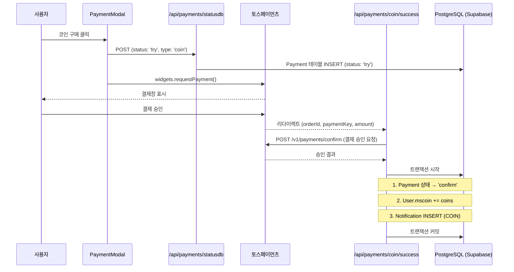
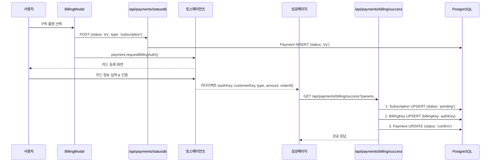
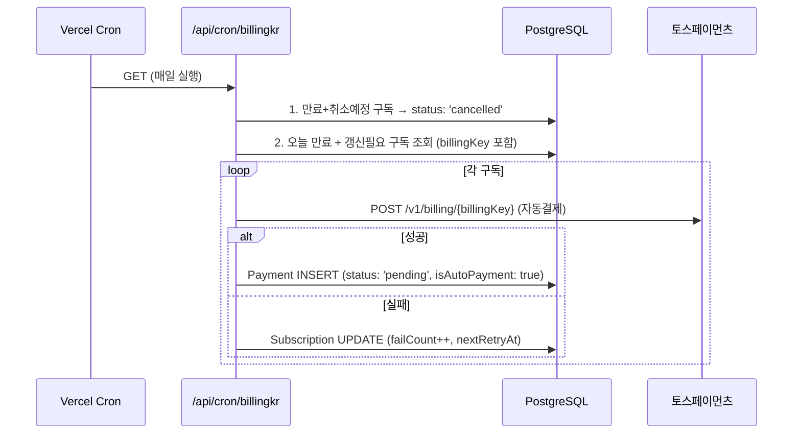
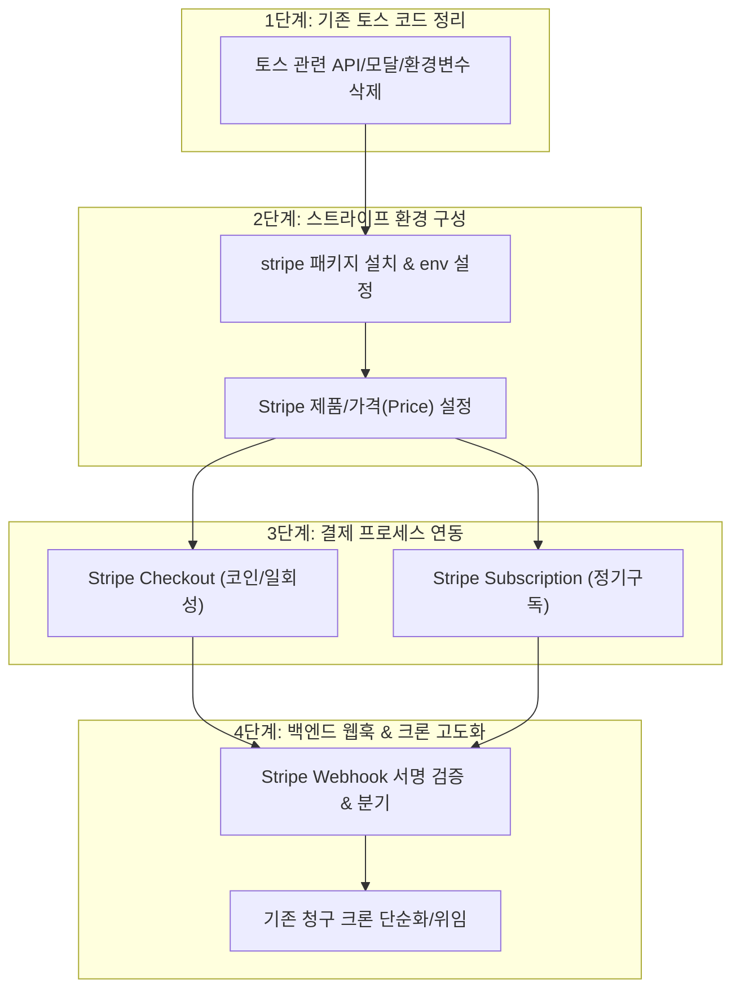
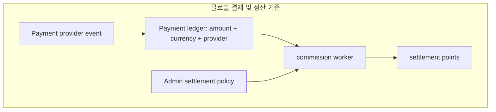

# 💳 결제 시스템 현황 종합 분석 보고서 (개선 계획 포함)

> **분석 대상**: 토스페이먼츠 테스트모드 기반 결제 시스템 및 페이지 전수조사  
> **분석 일자**: 2026-05-26  
> **작성자**: 시니어 총괄 개발 책임자

---

## 0. 2026-05-26 결제 구현 제거 후 현재 상태

현재 코드베이스의 실제 결제 실행부는 제거되어 있습니다. 이 문서의 1~7장은 삭제 전 결제 구현을 분석한 기록이며, 현재 운영 기준은 아래 내용입니다.

### 삭제 완료

- 결제 위젯 모달 삭제: `PaymentModal.tsx`, `BillingModal.tsx`
- 결제 성공/실패 결과 페이지 삭제: `/usermenu/payments/result/coin/*`, `/usermenu/payments/result/billing/*`
- 결제 중계 API 삭제: `/api/payments/coin/*`, `/api/payments/billing/*`, `/api/payments/statusdb`, `/api/payments/webhook`
- 결제 SDK 의존성 삭제: `@tosspayments/payment-widget-sdk`, `@tosspayments/tosspayments-sdk`
- 로컬 환경변수 삭제: `NEXT_PUBLIC_TOSS_PAYMENTS_CLIENT_KEY`, `NEXT_PUBLIC_BILLING_PAYMENTS_CLIENT_KEY`, `TOSS_PAYMENTS_SECRET_KEY`

### 유지 대상

- DB 모델 유지: `Payment`, `Subscription`, `BillingKey`, `webhookLog`
- 관리자 가격 설정 유지: `subscriptionPackages`, `coinPackages`의 KRW `price`와 USD `globalPrice`
- `/subscription` 페이지 유지: 주간/연간 선택, 코인 수량 선택 후 버튼 활성화 UX 유지
- 결제 후속 구현을 위한 데이터 구조 유지: 결제 제공자, 통화, 상태값, 웹훅, 정기구독 저장 구조는 다음 글로벌 결제 제공자 도입 시 재사용

### 현재 동작

- `/subscription` 페이지의 표시 가격은 `globalPrice` 기반 USD로 표기합니다.
- 주간/연간 구독 버튼 또는 코인 구매 버튼을 누르면 실제 결제를 호출하지 않고 토스트로 `결제구현시 작동합니다`를 표시합니다.
- 코인 구매 버튼은 기존처럼 코인 수량을 선택해야 활성화됩니다.
- `/api/cron/billingkr`는 외부 자동청구를 호출하지 않고, 만료된 구독 상태 정리와 갱신 후보 카운트만 수행합니다.
- `/api/payments/cancel`은 다음 글로벌 결제 제공자 구현 전까지 `501`로 응답합니다.

### 통계/정산 영향

이번 삭제는 시청기록 수집, 포인트 수수료 계산, 지급 원장, 통계 작성 시뮬레이션에 영향을 주지 않도록 결제 실행부에만 제한했습니다.

- 시청/정산 워커 기준 원장: `video_views`, D1 `grouped_views`, `grouped_view_details`, `commission_batch`, `cf_stats`
- 유지한 설정 기준: `subscriptionPackages`, `coinPackages`, 포인트/코인 환산 설정
- 유지한 DB 기준: 결제 및 구독 관련 테이블은 삭제하지 않았으므로 다음 결제 구현과 과거 데이터 호환성을 보존합니다.

## 1. 결제 플로우 및 DB 변경 상세

### 1-A. 코인 구매 (일회성 결제)

코인 구매는 토스페이먼츠 **일반결제 위젯(Payment Widgets)** 방식을 사용합니다.

#### 전체 플로우



#### DB 변경 상세

| 시점 | 테이블 | 필드 | 값 |
|------|--------|------|-----|
| 결제 시도 | `Payment` | `status`, `type`, `amount`, `orderId` | `'try'`, `'coin'`, 금액, orderId |
| 결제 승인 | `Payment` | `status`, `paymentKey`, `approvedAt`, `method` | `'confirm'`, 토스 paymentKey, 현재시간, 실제결제수단 |
| 코인 지급 | `users` | `mscoin` | `+= 구매수량` |
| 알림 생성 | `notifications` | `type`, `metadata` | `'COIN'`, `{amount, reason: '코인구매'}` |

> [!IMPORTANT]
> **코인 결제는 실제로 토스페이먼츠 서버에 `confirm` API를 호출**하고 있습니다. 테스트모드에서도 정상 동작하며, 결제 승인 후 DB 트랜잭션으로 원자적 처리를 수행합니다.

---

### 1-B. 구독 결제 (빌링키 방식)

구독 결제는 토스페이먼츠 **자동결제(Billing)** 방식을 사용합니다. 카드 등록 → 빌링키 발급 → 이후 자동 청구 흐름입니다.

#### 최초 구독 등록 플로우



#### DB 변경 상세

| 시점 | 테이블 | 필드 | 값 |
|------|--------|------|-----|
| 결제 시도 | `Payment` | INSERT | `status: 'try'`, `type: 'subscription'`, `method: 'weekly'/'yearly'/'upgrade'` |
| 구독 생성 | `subscriptions` | UPSERT | `status: 'pending'`, `type`, `currentPeriodStart`, `currentPeriodEnd` |
| 빌링키 저장 | `billing_keys` | UPSERT | `billingKey: authKey`, `customerKey`, `status: 'active'` |
| 결제 확인 | `Payment` | UPDATE | `status: 'confirm'`, `approvedAt`, `billingKey` |

> [!WARNING]
> **핵심 문제 발견: 구독 상태가 `'pending'`으로 남습니다!**  
> [billing/success/route.ts](file:///Users/tigerk/Desktop/megas/src/app/api/payments/billing/success/route.ts#L64-L79)를 보면, `subscription.status`가 `'pending'`으로 설정된 채 `'active'`로 변경되지 않습니다. 또한 `User.subscriptionEndDate`도 업데이트되지 않습니다.

---

### 1-C. 구독 갱신 (자동결제 크론)

[billingkr/route.ts](file:///Users/tigerk/Desktop/megas/src/app/api/cron/billingkr/route.ts)에서 매일 크론으로 처리합니다.

#### 자동 갱신 플로우



#### DB 변경 상세

| 처리 | 테이블 | 조건 | 변경 |
|------|--------|------|------|
| 취소 처리 | `subscriptions` | `status='active'` & `cancelAtPeriodEnd=true` & `currentPeriodEnd < 오늘자정` | `status → 'cancelled'` |
| 결제 생성 | `Payment` | 갱신 대상 | INSERT: `status:'pending'`, `billingKey`, `metadata:{isAutoPayment:true, nextPeriodEnd}` |
| 실패 기록 | `subscriptions` | 결제 실패 | `failCount++`, `lastFailedAt`, `nextRetryAt` |

> [!CAUTION]
> **자동 갱신 후 구독 기간 연장이 누락되어 있습니다!**  
> 크론에서 결제를 생성하지만, `subscription.currentPeriodEnd`를 갱신하는 로직이 없습니다.  
> 이 로직은 [webhook/route.ts](file:///Users/tigerk/Desktop/megas/src/app/api/payments/webhook/route.ts#L160-L191)에만 존재하는데, 웹훅은 테스트모드에서 동작하지 않습니다.

---

### 1-D. 구독 취소

[cancel/route.ts](file:///Users/tigerk/Desktop/megas/src/app/api/user/subscription/cancel/route.ts)에서 처리합니다.

| 테이블 | 변경 내용 |
|--------|----------|
| `subscriptions` | `cancelAtPeriodEnd → true` (즉시 취소가 아님, 기간 만료 시 취소) |

> [!NOTE]
> 취소는 `cancelAtPeriodEnd=true`로만 설정하고, 실제 `status → 'cancelled'` 전환은 크론잡([billingkr](file:///Users/tigerk/Desktop/megas/src/app/api/cron/billingkr/route.ts#L12-L24))이 기간 만료 시 처리합니다.

---

### 1-E. 구독 업그레이드 (weekly → yearly)

[billing/success/route.ts](file:///Users/tigerk/Desktop/megas/src/app/api/payments/billing/success/route.ts#L48-L61)에서 `type='upgrade'` 케이스로 처리합니다.

- 현재 구독의 `currentPeriodEnd`를 기준으로 **+1년** 연장
- 기존 구독이 없으면 에러
- `subscription.type`이 `'upgrade'`로 변경됨

> [!WARNING]
> **업그레이드 시 `type`이 `'upgrade'`로 저장**됩니다. 이후 크론잡의 금액 계산에서 `subscription.type === 'weekly' ? 8500 : 190000`으로 판단하는데, `'upgrade'`는 어디에도 매칭되지 않아 `190000`(yearly)으로 결제됩니다. 의도한 것일 수 있지만 명시적이지 않습니다.

---

### 1-F. 웹훅 (현재 구현 상태)

[webhook/route.ts](file:///Users/tigerk/Desktop/megas/src/app/api/payments/webhook/route.ts)는 **코드는 존재하지만 실제 동작하지 않습니다.**

#### 웹훅이 하도록 설계된 것들:
1. `webhookLog` 테이블에 로그 저장
2. `Payment.status` 업데이트 (`statusdb` API 호출)
3. 코인 결제 DONE → `User.mscoin` 증가
4. 구독 결제 DONE → `Subscription.status → 'active'`, `User.subscriptionEndDate` 업데이트
5. 결제 취소 → 코인 차감 또는 구독 `cancelAtPeriodEnd` 설정

> [!CAUTION]
> **결제 솔루션 변경 시 가장 중요한 포인트입니다.**  
> 현재는 웹훅 없이 **클라이언트 리다이렉트 기반**으로 결제 확인을 하고 있어, 구독 결제에서 `status`가 `'pending'`에서 `'active'`로 전환되지 않는 치명적 문제가 있습니다.  
> **권장 방식**: 결제 성공 → 웹훅 수신 → DB 업데이트 (Single Source of Truth)

---

### 1-G. 권장 결제 처리 방식 vs 현재 구현 비교

| 항목 | 권장 방식 | 현재 구현 |
|------|----------|----------|
| 결제 확인 기준 | **웹훅 기반** (서버→서버) | 클라이언트 리다이렉트 기반 |
| DB 업데이트 시점 | 웹훅 수신 후 (확정된 결제만) | 리다이렉트 콜백 즉시 |
| 구독 활성화 | 웹훅에서 `status → 'active'` | ❌ `'pending'`에서 멈춤 |
| `User.subscriptionEndDate` | 웹훅에서 동기화 | ❌ 업데이트 안됨 (billing/success에서) |
| 결제 취소/환불 | 웹훅으로 자동 감지 | 관리자 수동 API만 존재 |
| 결제 무결성 검증 | 토스 서명 검증 | ❌ 서명 검증 없음 |
| `revalidateTag` | 웹훅 처리 후 캐시 무효화 | billing/success에서만 호출 |

---

## 2. 구독 상태 관리 (Single Source of Truth)

### 2-A. 구독 정보 저장 위치 및 이중 관리 이슈

현재 구독 정보는 데이터베이스에서 **두 군데로 나누어 이중 관리**되고 있습니다:

1. `subscriptions` 테이블: `status`, `type`, `currentPeriodEnd`, `cancelAtPeriodEnd` 등 (주요 구독 원장 테이블)
2. `users` 테이블: `subscriptionEndDate` 컬럼 (레거시/보조 필드)

#### 전수조사 및 Stale Data 발생 현황:
* **웹훅의 동작**: [webhook/route.ts](file:///Users/tigerk/Desktop/megas/src/app/api/payments/webhook/route.ts#L188)가 실행될 때만 `users.subscriptionEndDate`가 업데이트되도록 설계되어 있습니다.
* **클라이언트의 API 콜백**: 토스페이먼츠 결제 완료 콜백 API인 [billing/success/route.ts](file:///Users/tigerk/Desktop/megas/src/app/api/payments/billing/success/route.ts#L287)에서는 `users.subscriptionEndDate` 업데이트 로직이 **주석 처리**되어 있어 실행되지 않습니다.
* **결과**: 테스트모드 빌링 성공 시 `subscriptions` 테이블의 만료 시점만 늘어나고 `users` 테이블에는 동기화되지 않는 데이터 정합성 불일치(Stale Data) 문제가 발생합니다.

### 2-B. 구독 확인 API 목록

#### API 1: `/api/users/[userId]/auth` — 시청 권한 체크용
- **파일**: [auth/route.ts](file:///Users/tigerk/Desktop/megas/src/app/api/users/%5BuserId%5D/auth/route.ts)
- **반환 데이터**: `subscription.currentPeriodEnd` (subscriptions 테이블 조회)
- **캐시**: `unstable_cache` 12시간 + React Query 12시간 = **최대 24시간 지연**
- **캐시 태그**: `user-auth`

#### API 2: `/api/subscription/status` — 구독 페이지 버튼 표시용
- **파일**: [status/route.ts](file:///Users/tigerk/Desktop/megas/src/app/api/subscription/status/route.ts)
- **반환 데이터**: `type`, `status`, `currentPeriodEnd` (`subscriptions` 테이블의 값을 파싱하여 반환하되, 응답 JSON에는 `subscriptionEndDate`라는 이름의 별칭으로 매핑하여 전달함)
- **캐시**: React Query `staleTime: 12시간`

---

## 3. 결제 및 구독 관련 전수조사 페이지/API 리스트

프로젝트 내에서 결제 및 구독 처리, UI 노출, 백엔드 로직이 수행되는 모든 지점을 전수조사한 리스트입니다.

### 3-A. 프론트엔드 UI 페이지 및 컴포넌트

1. **구독 및 코인 구매 메인 페이지**
   * **URL 경로**: `/subscription` (예: `http://localhost:3000/ko/subscription`)
   * **관련 파일**:
     * [Subscription.tsx](file:///Users/tigerk/Desktop/megas/src/app/%5Blocale%5D/%28main%29/%28static%29/subscription/Subscription.tsx): 구독 요금제(주간/연간) 카드 및 코인 선택 라디오 버튼 리스트.
     * [SubscriptionButton.tsx](file:///Users/tigerk/Desktop/megas/src/app/%5Blocale%5D/%28main%29/%28static%29/subscription/SubscriptionButton.tsx): 구독 버튼 UI.
     * [CoinPurchaseButton.tsx](file:///Users/tigerk/Desktop/megas/src/app/%5Blocale%5D/%28main%29/%28static%29/subscription/CoinPurchaseButton.tsx): 코인 결제 버튼 UI.

2. **결제 대화상자(Toss Payments Widget 연동)**
   * **관련 파일**:
     * [PaymentModal.tsx](file:///Users/tigerk/Desktop/megas/src/app/%5Blocale%5D/%28main%29/usermenu/payments/PaymentModal.tsx): 코인 충전을 위한 Toss **일반결제 위젯** 연동 모달.
     * [BillingModal.tsx](file:///Users/tigerk/Desktop/megas/src/app/%5Blocale%5D/%28main%29/usermenu/payments/BillingModal.tsx): 정기 구독 결제를 위한 빌링키 등록 및 인증(Toss **자동결제**) 연동 모달.
     * [PaymentSuccessModal.tsx](file:///Users/tigerk/Desktop/megas/src/app/%5Blocale%5D/%28main%29/usermenu/payments/PaymentSuccessModal.tsx) & [BillingSuccessModal.tsx](file:///Users/tigerk/Desktop/megas/src/app/%5Blocale%5D/%28main%29/usermenu/payments/BillingSuccessModal.tsx): 완료 팝업.

3. **마이페이지 / 사용자 프로필 화면**
   * **URL 경로**: `/usermenu/users/[username]`
   * **관련 파일**:
     * [page.tsx](file:///Users/tigerk/Desktop/megas/src/app/%5Blocale%5D/%28main%29/usermenu/users/%5Busername%5D/page.tsx): 프로필 상세 정보의 "Status" 영역에 구독 상태 표시 및 비구독자 대상 구독하기 바로가기 버튼 제공.
     * [UserTabsClient.tsx](file:///Users/tigerk/Desktop/megas/src/app/%5Blocale%5D/%28main%29/usermenu/users/%5Busername%5D/UserTabsClient.tsx): 탭 매니저. **현재 결제내역(`pay`) 탭이 주석 처리 및 임시 텍스트(`paymentRegistrationPending`)로 비활성화되어 있음.**
     * [PaymentHistory.tsx](file:///Users/tigerk/Desktop/megas/src/app/%5Blocale%5D/%28main%29/usermenu/users/%5Busername%5D/PaymentHistory.tsx): 사용자 본인의 결제 리스트를 API를 통해 불러와 렌더링하는 컴포넌트(현재 주석으로 가려짐).
     * [EditProfileDialog.tsx](file:///Users/tigerk/Desktop/megas/src/app/%5Blocale%5D/%28main%29/usermenu/users/%5Busername%5D/EditProfileDialog.tsx): 프로필 변경 모달 내의 구독 상태 정보 표시.

4. **관리자 서비스 관리 페이지**
   * **URL 경로**: `/admin/service` (예: `http://localhost:3000/ko/admin/service?tab=user`)
   * **관련 파일**:
     * [ServiceTabs.tsx](file:///Users/tigerk/Desktop/megas/src/app/%5Blocale%5D/%28main%29/admin/service/components/ServiceTabs.tsx): 서비스 관리 상단 탭. (현재 `notice`, `inquiry`, `logs`, `user`로 구성됨)
     * [UserManagementClient.tsx](file:///Users/tigerk/Desktop/megas/src/app/%5Blocale%5D/%28main%29/admin/service/components/users/UserManagementClient.tsx): 회원 정보 리스트/상세 팝업. **회원 정보 상세에서 'Edit' 액션을 통해 구독 타입(`free`, `basic`, `premium`)을 수동으로 임의 변경할 수 있는 모달 연동.**

5. **관리자 요금제/코인 패키지 설정 페이지**
   * **URL 경로**: `/admin/system` (예: `http://localhost:3000/ko/admin/system?tab=settings`)
   * **관련 파일**:
     * [SystemSettings.tsx](file:///Users/tigerk/Desktop/megas/src/app/%5Blocale%5D/%28main%29/admin/system/components/SystemSettings.tsx): `subscriptionPackages` 및 `coinPackages` 설정값을 관리하여 `/subscription` 화면에 가격 정보를 실시간 노출.

6. **결제 리다이렉트 (Toss Payments Callback) 페이지**
   * **URL 경로**: `/usermenu/payments/result/*`
   * **관련 파일**:
     * [result/coin/success/page.tsx](file:///Users/tigerk/Desktop/megas/src/app/%5Blocale%5D/%28main%29/usermenu/payments/result/coin/success/page.tsx): 코인 결제 성공 콜백을 API로 중계하고 결과를 사용자에게 노출.
     * [result/coin/fail/page.tsx](file:///Users/tigerk/Desktop/megas/src/app/%5Blocale%5D/%28main%29/usermenu/payments/result/coin/fail/page.tsx): 코인 결제 실패 화면.
     * [result/billing/success/page.tsx](file:///Users/tigerk/Desktop/megas/src/app/%5Blocale%5D/%28main%29/usermenu/payments/result/billing/success/page.tsx): 빌링키 발급 성공 및 첫 결제 처리 중계.
     * [result/billing/fail/page.tsx](file:///Users/tigerk/Desktop/megas/src/app/%5Blocale%5D/%28main%29/usermenu/payments/result/billing/fail/page.tsx): 빌링 등록 실패 화면.

### 3-B. 백엔드 API 및 크론 엔드포인트

1. **결제 비즈니스 로직 연동 API**
   * `/api/payments/coin/success` ([success/route.ts](file:///Users/tigerk/Desktop/megas/src/app/api/payments/coin/success/route.ts)): 코인 승인 및 지급 트랜잭션.
   * `/api/payments/coin/fail` ([fail/route.ts](file:///Users/tigerk/Desktop/megas/src/app/api/payments/coin/fail/route.ts)): 코인 결제 실패 상태 DB 업데이트.
   * `/api/payments/billing/success` ([success/route.ts](file:///Users/tigerk/Desktop/megas/src/app/api/payments/billing/success/route.ts)): 정기 결제용 빌링키 저장 및 `pending` 구독 등록.
   * `/api/payments/billing/fail` ([fail/route.ts](file:///Users/tigerk/Desktop/megas/src/app/api/payments/billing/fail/route.ts)): 빌링키 발급 실패 상태 기록.
   * `/api/payments/statusdb` ([statusdb/route.ts](file:///Users/tigerk/Desktop/megas/src/app/api/payments/statusdb/route.ts)): Toss 결제 팝업 실행 시점에 임시 결제 내역(`status: 'try'`) 생성 및 취소 사유 업데이트.
   * `/api/payments/cancel` ([cancel/route.ts](file:///Users/tigerk/Desktop/megas/src/app/api/payments/cancel/route.ts)): 관리자에 의한 수동 결제 취소 처리.
   * `/api/payments/webhook` ([webhook/route.ts](file:///Users/tigerk/Desktop/megas/src/app/api/payments/webhook/route.ts)): 토스 결제 통보 웹훅 수신처.

2. **사용자 구독 및 결제정보 연동 API**
   * `/api/users/[userId]/auth` ([auth/route.ts](file:///Users/tigerk/Desktop/megas/src/app/api/users/%5BuserId%5D/auth/route.ts)): 시청 시점의 구독 만료일 조회.
   * `/api/subscription/status` ([status/route.ts](file:///Users/tigerk/Desktop/megas/src/app/api/subscription/status/route.ts)): 구독 정보 노출용 상태 반환.
   * `/api/user/subscription/cancel` ([cancel/route.ts](file:///Users/tigerk/Desktop/megas/src/app/api/user/subscription/cancel/route.ts)): 사용자가 구독을 '기간 만료 후 해지'하기 위해 취소 플래그(`cancelAtPeriodEnd`) 설정.
   * `/api/admin/users/[userId]` ([route.ts](file:///Users/tigerk/Desktop/megas/src/app/api/admin/users/%5BuserId%5D/route.ts)): 관리자의 강제 구독 상태 및 만료일 수동 업데이트 API.

3. **자동 결제 배치 크론**
   * `/api/cron/billingkr` ([billingkr/route.ts](file:///Users/tigerk/Desktop/megas/src/app/api/cron/billingkr/route.ts)): 매일 갱신 대상 구독 목록을 추출해 빌링키 기반으로 자동 청구하는 시스템 배치.

---

## 4. 관리자 페이지 내 결제기록 (Payment History) 탭 설계안

사용자가 서비스 관리(`admin/service`) 화면에서 결제 흐름의 무결성(클라이언트 완료 vs 웹훅 완료 여부)을 한눈에 추적할 수 있도록 신규 탭을 다음과 같이 설계합니다.

### 4-A. UI 기획 및 레이아웃 제안

* **신규 탭 추가**: `/admin/service?tab=payments` (아이콘: `CreditCard`)
* **필터/검색 바**:
  * 결제 상태: `전체`, `결제시도(try)`, `클라이언트확인(confirm/success)`, `승인실패(fail)`, `취소됨(cancelled)`
  * 결제 종류: `전체`, `코인`, `구독`
  * 사용자 ID/이메일 검색 창
  * 결제 일자 범위 선택
* **데이터 테이블 컬럼 구성**:

| Order ID | 사용자 | 종류 | 결제금액 | 결제시도 | 클라이언트 완료 | 웹훅 수신 여부 | 최종 상태 | 액션 |
|----------|--------|------|----------|----------|-----------------|----------------|-----------|------|
| `order-123` | 홍길동 (user1) | 구독 (weekly) | 8,500원 | 05-26 12:00 | ✅ 완료 | ✅ 수신완료 (DONE) | **Success** | [상세보기] / [결제취소] |
| `order-456` | 이몽룡 (user2) | 코인 (100개) | 12,000원 | 05-26 12:15 | ✅ 완료 | ❌ 미수신 (오류의심) | **Confirm** | [상세보기] / [수동동기화] |
| `order-789` | 성춘향 (user3) | 구독 (yearly) | 190,000원 | 05-26 12:30 | ❌ 미완료 | ❌ 미수신 | **Try** | [상세보기] |

> [!TIP]
> **클라이언트 완료 vs 웹훅 완료 대조 로직**:
> * **클라이언트 완료** (`Client status`): 리다이렉트 콜백에 의해 `Payment.status`가 `'confirm'` 또는 `'success'`로 갱신된 상태.
> * **웹훅 수신 여부** (`Webhook status`): `webhookLog` 테이블에서 해당 `orderId` 혹은 `paymentKey`를 조회하여 `status`가 `'success'`인 로그가 존재하고, DB 원장에 반영이 완료되었는지 대조하여 판정.
> * **이유**: 클라이언트 리다이렉트는 네트워크 유실, 탭 닫기 등으로 누락될 수 있으나 웹훅은 100% 보장되므로, **두 상태의 교차 대조**를 통해 유실된 결제 승인 건을 추적하고 [수동 동기화] 액션 버튼을 통해 수동 처리가 가능하도록 지원합니다.

---

## 5. 구독 정보 단일 소스화 (Single Source of Truth) 개선안

`User.subscriptionEndDate` 필드와 `Subscription` 테이블의 불일치를 해결하고 단일 원장을 구축하기 위한 구체적인 방법입니다.

### 5-A. 제안 방향: `User.subscriptionEndDate` 제거 및 `Subscription` 통합

가장 안전하고 구조적인 방법은 `User` 테이블의 `subscriptionEndDate` 컬럼을 **제거**하거나, 데이터 동기화를 위해 **자동 업데이트 가상 필드** 또는 **트랜잭션 바인딩**을 사용하는 것입니다.

#### 방법 1: `users.subscriptionEndDate` 컬럼의 물리적/논리적 제거 (권장)
* **내용**: `prisma/schema.prisma`에서 `subscriptionEndDate`를 지우고 데이터 모델에서 완전히 삭제합니다.
* **조치사항**:
  * [types.ts](file:///Users/tigerk/Desktop/megas/src/lib/types.ts)의 `UserData` 타입 및 `getUserDataSelect` 쿼리에서 `subscriptionEndDate` 컬럼 제거.
  * 시청 권한 확인([PlayPermissionCheck.tsx](file:///Users/tigerk/Desktop/megas/src/components/videos/PlayPermissionCheck.tsx)) 및 인증 API([auth/route.ts](file:///Users/tigerk/Desktop/megas/src/app/api/users/%5BuserId%5D/auth/route.ts))에서 구독 여부를 판단할 때, 단일 소스인 `Subscription` 관계 모델의 `status === 'active' && currentPeriodEnd >= now`를 읽도록 완전 단일화.

#### 방법 2: `Subscription` 상태 변경 시 `users` 자동 업데이트 (트리거/미들웨어)
Prisma Schema 마이그레이션이 제한적이거나 레거시 의존성을 즉시 제거하기 어려운 경우:
* **내용**: `Subscription` 정보가 수정될 때마다 `User.subscriptionEndDate`를 항상 동기화하는 로직을 Prisma 클라이언트 미들웨어 또는 트랜잭션 도우미에 의무화합니다.
* **조치사항**:
  * 결제 콜백([billing/success/route.ts](file:///Users/tigerk/Desktop/megas/src/app/api/payments/billing/success/route.ts)), 크론([billingkr/route.ts](file:///Users/tigerk/Desktop/megas/src/app/api/cron/billingkr/route.ts)), 관리자 강제 수정([api/admin/users/[userId]/route.ts](file:///Users/tigerk/Desktop/megas/src/app/api/admin/users/%5BuserId%5D/route.ts)) 등 구독 상태를 변경하는 **모든 백엔드 로직**에서 `tx.subscription.upsert`와 `tx.user.update(subscriptionEndDate)`가 단일 트랜잭션 내에서 원자적으로 함께 반영되도록 코드를 일괄 보강합니다.

---

## 6. 발견된 문제점 및 개선 필요사항 요약

| # | 분류 | 내용 | 파일 / 위치 | 영향 |
|---|---|---|---|---|
| 1 | 🔴 심각 | 구독 활성화(`active` 전환) 실패 | [billing/success](file:///Users/tigerk/Desktop/megas/src/app/api/payments/billing/success/route.ts) | 구독 결제 콜백 시 `pending` 상태에서 `active`로 변경하지 않아 시청 불통 가능. |
| 2 | 🔴 심각 | 자동갱신 시 구독기간 연장 누락 | [billingkr cron](file:///Users/tigerk/Desktop/megas/src/app/api/cron/billingkr/route.ts) | 갱신 결제 정보는 생성하지만 `currentPeriodEnd`를 직접 늘려주는 로직 부재. |
| 3 | 🟡 중요 | 사용자 프로필 결제내역 탭 주석 처리됨 | [UserTabsClient](file:///Users/tigerk/Desktop/megas/src/app/[locale]/(main)/usermenu/users/[username]/UserTabsClient.tsx) | 결제내역 탭 진입 시 실제 정보 대신 '대기 중...' 임시 문구만 노출. |
| 4 | 🟡 중요 | `subscriptionEndDate` 이중화 및 미동기화 | [types.ts](file:///Users/tigerk/Desktop/megas/src/lib/types.ts) 등 | 유저 테이블 컬럼과 구독 테이블의 값이 서로 일치하지 않아 서비스 조회 시 오작동 우려. |
| 5 | 🟢 권장 | Toss Confirm API 서명 검증 누락 | [webhook/route.ts](file:///Users/tigerk/Desktop/megas/src/app/api/payments/webhook/route.ts) | 승인 콜백이나 웹훅 수신 시 데이터 무결성을 검증하는 시그니처 체크 로직 부재. |

---

## 7. 결제 솔루션 변경 시 체크리스트

- [ ] **구독 결제 즉시 `subscription.status`를 `'active'`로 활성화하는 로직 반영**
- [ ] **클라이언트 콜백과 무관하게 100% 신뢰할 수 있는 웹훅 기반의 단일 소스 DB 동기화 시스템 구축**
- [ ] **`User.subscriptionEndDate` 필드 폐지 또는 트랜잭션 동기화 통일**
- [ ] **자동 결제 갱신 성공 시 `Subscription.currentPeriodEnd` 자동 연장 처리 보강**
- [ ] **관리자 페이지(`admin/service`) 내에 클라이언트 승인 및 웹훅 완료 여부 교차 검증용 결제기록 탭 구현**
- [ ] **사용자 프로필(`/usermenu/users/[username]`)의 결제내역(`PaymentHistory.tsx`) 탭 주석 제거 및 실데이터 연동 활성화**
- [ ] **결제 무결성 보장을 위해 Webhook Request Header Signature(서명) 검증 구현**
- [ ] **결제 상태값 일원화** (Payment 테이블의 status 필드 값 포맷 정리 및 Enum 적용)

---

## 8. Stripe(스트라이프) 결제 시스템 전환 로드맵

토스페이먼츠(Toss Payments)를 완전히 삭제하고 글로벌 결제 솔루션인 **Stripe**로 전면 전환할 때 필요한 단계별 마이그레이션 및 신규 구현 가이드입니다.



### 8-A. 기존 토스페이먼츠 코드 삭제 대상 전수조사

Stripe 도입 시 충돌을 방지하고 깔끔한 코드베이스를 유지하기 위해 다음 파일들을 안전하게 삭제하거나 전면 수정합니다.

#### 1. 삭제할 파일 목록
* **프론트엔드 모달**:
  * [PaymentModal.tsx](file:///Users/tigerk/Desktop/megas/src/app/[locale]/(main)/usermenu/payments/PaymentModal.tsx): 코인 충전용 토스 결제위젯 로드 모달 (삭제)
  * [BillingModal.tsx](file:///Users/tigerk/Desktop/megas/src/app/[locale]/(main)/usermenu/payments/BillingModal.tsx): 구독 정기결제 빌링 등록 모달 (삭제)
* **백엔드 토스 중계 API**:
  * [api/payments/coin/success](file:///Users/tigerk/Desktop/megas/src/app/api/payments/coin/success/route.ts): 삭제
  * [api/payments/coin/fail](file:///Users/tigerk/Desktop/megas/src/app/api/payments/coin/fail/route.ts): 삭제
  * [api/payments/billing/success](file:///Users/tigerk/Desktop/megas/src/app/api/payments/billing/success/route.ts): 삭제
  * [api/payments/billing/fail](file:///Users/tigerk/Desktop/megas/src/app/api/payments/billing/fail/route.ts): 삭제
  * [api/payments/statusdb](file:///Users/tigerk/Desktop/megas/src/app/api/payments/statusdb/route.ts): 삭제 (결제 시도 시점 임시저장용이었으나, Stripe Checkout은 웹훅이 이를 대체함)
* **환경 변수 (.env 및 .env.local)**:
  * `NEXT_PUBLIC_TOSS_CLIENT_KEY`, `TOSS_SECRET_KEY` 관련 라인 삭제

---

### 8-B. Stripe 환경 구성 및 설정

#### 1. 라이브러리 설치
프로젝트 루트에서 Stripe 백엔드/프론트엔드 SDK를 추가합니다.
```bash
pnpm add stripe @stripe/stripe-js
```

#### 2. 환경 변수 추가
`.env.local` 및 클라우드 배포 플랫폼(Vercel 등) 환경변수에 아래 정보를 추가합니다.
```env
# 백엔드 Secret Keys
STRIPE_SECRET_KEY=sk_test_...         # Stripe 대시보드 -> API keys
STRIPE_WEBHOOK_SECRET=whsec_...       # Stripe CLI 로컬 테스트 또는 대시보드 웹훅 시크릿

# 프론트엔드 Public Keys
NEXT_PUBLIC_STRIPE_PUBLISHABLE_KEY=pk_test_...
```

---

### 8-C. Stripe 기반 결제 아키텍처 재설계

#### 1. 코인 구매 (일회성 결제) 흐름
* **로직**: Stripe의 호스팅 결제창 방식인 **Stripe Checkout Session**을 이용해 구현합니다.
* **사용자 행동**: 코인 선택 -> [Checkout API 호출] -> [Stripe 결제창 리다이렉트] -> [결제 완료 후 성공페이지 이동]
* **원장 지급**: 결제창 성공 즉시 지급하지 않고, **Stripe Webhook (`checkout.session.completed`) 수신 시점에 트랜잭션**으로 안전하게 코인을 지급하고 원장을 기록합니다.

#### 2. 정기 구독 결제 흐름
* **로직**: Stripe **Billing(Subscriptions)**의 내장 스케줄러를 이용합니다.
* **사용자 행동**: 구독 요금제 선택 -> [Stripe Price ID와 연동된 Checkout Session 생성] -> [카드 정보 입력 및 결제 완료] -> [성공페이지 이동]
* **구독 활성화**: 웹훅 (`invoice.payment_succeeded` 또는 `customer.subscription.created`)을 통해 활성 구독 상태(`status: 'active'`) 및 `currentPeriodEnd`를 원장에 업데이트합니다.

---

### 8-D. 단계별 구축 및 구현 순서 (Step-by-Step)

#### [Step 1] Stripe 인스턴스 초기화 유틸리티 생성
백엔드에서 Stripe API를 간편하게 호출할 싱글톤 인스턴스 유틸리티를 작성합니다.
* **신규 파일**: `src/lib/stripe.ts`
```typescript
import Stripe from 'stripe';

if (!process.env.STRIPE_SECRET_KEY) {
  throw new Error('Missing STRIPE_SECRET_KEY');
}

export const stripe = new Stripe(process.env.STRIPE_SECRET_KEY, {
  apiVersion: '2025-01-27.acacia' as any, // 최신 API 버전 지정
  typescript: true,
});
```

#### [Step 2] Stripe Checkout Session 생성 API 구현
코인 구매와 정기 구독 플랜 결제를 위한 Stripe 결제 창 생성 API를 구축합니다.
* **신규 파일**: `src/app/api/payments/stripe/checkout/route.ts`
```typescript
import { validateRequest } from "@/auth";
import { stripe } from "@/lib/stripe";
import prisma from "@/lib/prisma";
import { NextRequest, NextResponse } from "next/server";

export async function POST(request: NextRequest) {
  try {
    const { user } = await validateRequest();
    if (!user) {
      return NextResponse.json({ error: "Unauthorized" }, { status: 401 });
    }

    const { type, packageId } = await request.json(); // 'coin' 또는 'subscription'
    const origin = request.headers.get("origin") || "http://localhost:3000";

    let sessionParams: any = {
      payment_method_types: ["card"],
      customer_email: user.email || undefined,
      metadata: {
        userId: user.id,
        paymentType: type,
        packageId: packageId,
      },
    };

    if (type === "coin") {
      // 1. 코인 일회성 결제 설정
      // 시스템 설정에서 코인 가격 조회
      const settings = await prisma.systemSetting.findUnique({ where: { key: "coinPackages" } });
      const coinPackages = settings?.value as any[];
      const pkg = coinPackages?.find((p) => p.amount === Number(packageId));
      if (!pkg) {
        return NextResponse.json({ error: "Invalid coin package" }, { status: 400 });
      }

      sessionParams = {
        ...sessionParams,
        mode: "payment",
        line_items: [
          {
            price_data: {
              currency: "usd", // 또는 krw
              product_data: {
                name: `${pkg.amount} Coins Recharge`,
                description: `Megashorts platform coin purchase.`,
              },
              unit_amount: pkg.price, // 금액 (Stripe는 소수점 단위 센트 기준인 경우가 많으므로 설정 통화에 맞춰 unit_amount 계산)
            },
            quantity: 1,
          },
        ],
        success_url: `${origin}/usermenu/payments/result/coin/success?session_id={CHECKOUT_SESSION_ID}`,
        cancel_url: `${origin}/subscription`,
      };
    } else {
      // 2. 정기 구독 결제 설정 (Subscription Mode)
      // Stripe Dashboard에 등록한 Price ID 조회 (예: price_1Qx...)
      const priceId = packageId === "weekly" ? "price_weekly_id" : "price_yearly_id";

      sessionParams = {
        ...sessionParams,
        mode: "subscription",
        line_items: [
          {
            price: priceId,
            quantity: 1,
          },
        ],
        success_url: `${origin}/usermenu/payments/result/billing/success?session_id={CHECKOUT_SESSION_ID}`,
        cancel_url: `${origin}/subscription`,
      };
    }

    const session = await stripe.checkout.sessions.create(sessionParams);

    // 결제 시도 로그 기록 (DB Payment 테이블)
    await prisma.payment.create({
      data: {
        userId: user.id,
        type: type,
        status: "try",
        amount: type === "coin" ? 100 : 8500, // 임시 금액 또는 실제 매핑
        orderId: session.id, // Checkout Session ID를 orderId로 매핑
      },
    });

    return NextResponse.json({ url: session.url });
  } catch (error: any) {
    console.error("Stripe Checkout Error:", error);
    return NextResponse.json({ error: error.message }, { status: 500 });
  }
}
```

#### [Step 3] 프론트엔드 구매 트리거 교체
구독 요금제 화면에서 기존 토스 모달 팝업 대신 Stripe Checkout API를 호출하여 결제 창으로 이동하도록 변경합니다.
* **수정 파일**: [Subscription.tsx](file:///Users/tigerk/Desktop/megas/src/app/%5Blocale%5D/%28main%29/%28static%29/subscription/Subscription.tsx)
```typescript
// 수정 전 (토스페이먼츠 모달 오픈):
// setShowBillingModal(true);

// 수정 후 (Stripe Checkout 리다이렉션):
const handleSubscription = async (type: string) => {
  const res = await fetch("/api/payments/stripe/checkout", {
    method: "POST",
    headers: { "Content-Type": "application/json" },
    body: JSON.stringify({ type: "subscription", packageId: type }),
  });
  const data = await res.json();
  if (data.url) {
    window.location.href = data.url; // Stripe 호스팅 결제창으로 이동
  } else {
    alert("결제 초기화 실패: " + data.error);
  }
};
```

#### [Step 4] Stripe Webhook API 구현 (가장 중요)
서버-서버 결제 검증을 보장하며, 결제 완료/실패/정기 갱신/취소 이벤트를 수신하는 안전한 웹훅 엔드포인트를 구현합니다.
* **수정 파일**: [src/app/api/payments/webhook/route.ts](file:///Users/tigerk/Desktop/megas/src/app/api/payments/webhook/route.ts)
```typescript
import { stripe } from "@/lib/stripe";
import prisma from "@/lib/prisma";
import { NextRequest, NextResponse } from "next/server";

export async function POST(request: NextRequest) {
  const body = await request.text();
  const signature = request.headers.get("stripe-signature") || "";

  let event;
  try {
    // 1. Stripe 서명 검증 (Webhook Secret 활용)
    event = stripe.webhooks.constructEvent(
      body,
      signature,
      process.env.STRIPE_WEBHOOK_SECRET || ""
    );
  } catch (err: any) {
    console.error(`Webhook Signature validation failed:`, err.message);
    return NextResponse.json({ error: "Invalid signature" }, { status: 400 });
  }

  // 2. Webhook 수신 원장 로그 생성
  await prisma.webhookLog.create({
    data: {
      eventType: event.type,
      payload: JSON.parse(body),
      status: "pending",
    },
  });

  const session = event.data.object as any;

  try {
    switch (event.type) {
      // A. 일회성 결제 및 첫 정기구독 Checkout 세션 완료 시점
      case "checkout.session.completed": {
        const userId = session.metadata?.userId;
        const paymentType = session.metadata?.paymentType;
        const packageId = session.metadata?.packageId;

        if (!userId) break;

        await prisma.$transaction(async (tx) => {
          // 결제 원장 상태 업데이트 ('confirm' -> 'success')
          await tx.payment.update({
            where: { orderId: session.id },
            data: {
              status: "success",
              paymentKey: session.payment_intent as string,
              approvedAt: new Date(),
            },
          });

          // 코인 충전인 경우
          if (paymentType === "coin") {
            await tx.user.update({
              where: { id: userId },
              data: {
                mscoin: { increment: Number(packageId) },
              },
            });
            // 알림 생성
            await tx.notification.create({
              data: {
                recipientId: userId,
                issuerId: "SYSTEM",
                type: "COIN",
                metadata: { amount: Number(packageId), reason: "Recharged" },
              },
            });
          }
        });
        break;
      }

      // B. 정기 구독 결제 승인/갱신 완료 시점 (Stripe Billing 자동 청구 완료)
      case "invoice.payment_succeeded": {
        const subscriptionId = session.subscription as string;
        if (!subscriptionId) break;

        // Stripe로부터 최신 구독 정보 가져오기
        const stripeSub = await stripe.subscriptions.retrieve(subscriptionId);
        const userId = stripeSub.metadata.userId;

        if (!userId) break;

        const periodStart = new Date(stripeSub.current_period_start * 1000);
        const periodEnd = new Date(stripeSub.current_period_end * 1000);

        await prisma.$transaction(async (tx) => {
          // 1. subscriptions 테이블 status 및 만료일 동기화 (SSOT)
          await tx.subscription.upsert({
            where: { userId },
            create: {
              userId,
              type: stripeSub.metadata.packageId || "weekly",
              status: "active",
              currentPeriodStart: periodStart,
              currentPeriodEnd: periodEnd,
            },
            update: {
              status: "active",
              currentPeriodStart: periodStart,
              currentPeriodEnd: periodEnd,
            },
          });

          // 2. 레거시 users.subscriptionEndDate 자동 동기화
          await tx.user.update({
            where: { id: userId },
            data: {
              subscriptionEndDate: periodEnd,
            },
          });
        });
        break;
      }

      // C. 정기 구독 갱신 실패/미승인 시점 (카드 잔액 부족 등)
      case "invoice.payment_failed": {
        const subscriptionId = session.subscription as string;
        if (!subscriptionId) break;

        const stripeSub = await stripe.subscriptions.retrieve(subscriptionId);
        const userId = stripeSub.metadata.userId;

        if (userId) {
          await prisma.subscription.update({
            where: { userId },
            data: {
              status: "past_due", // 결제 밀림 상태 변경
            },
          });
        }
        break;
      }

      // D. 정기 구독 최종 만료 및 취소 시점
      case "customer.subscription.deleted": {
        const subscriptionId = session.id as string;
        const stripeSub = session;
        const userId = stripeSub.metadata.userId;

        if (userId) {
          await prisma.$transaction(async (tx) => {
            await tx.subscription.update({
              where: { userId },
              data: {
                status: "cancelled", // 완전히 구독 해지 상태 변경
              },
            });
            await tx.user.update({
              where: { id: userId },
              data: {
                subscriptionEndDate: null, // 레거시 필드 초기화
              },
            });
          });
        }
        break;
      }
    }

    // 성공 로그 처리
    await prisma.webhookLog.updateMany({
      where: { eventType: event.type, status: "pending" },
      data: { status: "success" },
    });

    return NextResponse.json({ received: true });
  } catch (error: any) {
    console.error("Webhook processing error:", error);
    return NextResponse.json({ error: error.message }, { status: 500 });
  }
}
```

---

### 8-E. 결제 크론(Cron) 배치 변경 사항

* **기존 로직 ([billingkr/route.ts](file:///Users/tigerk/Desktop/megas/src/app/api/cron/billingkr/route.ts))**:
  * 매일 유저들의 구독 만료 시간을 감지하여 만료 예정 유저를 대상으로 토스페이먼츠 자동 결제 API를 **Next.js 서버가 직접 루프를 돌며 호출**하고 만료일을 강제 연장했습니다.
* **Stripe 도입 후 변경**:
  * **자체 스케줄링 불필요**: Stripe Billing은 요금제 만료 시점에 Stripe 클라우드가 **알아서 정기 자동 청구**하고, 그에 따른 결과를 웹훅(`invoice.payment_succeeded`, `invoice.payment_failed`)으로 던집니다.
  * **조치 내용**: 기존 `billingkr/route.ts` 배치 크론 파일은 더이상 외부 결제 호출을 할 필요가 없으므로 **전체 코드를 단순화**합니다.
  * **남은 역할**: 만료일이 이미 지났으나 웹훅 미수신 등의 오류로 활성 상태로 방치된 좀비 구독 상태를 예외적으로 만료(`cancelled` 등) 처리해주는 **데이터 동기화 검증용(Sanity Check) 보조 크론**으로 완전히 역할을 축소 및 간소화합니다.

---

### 8-F. 결제 취소 API 연동 수정
* **수정 파일**: [src/app/api/payments/cancel/route.ts](file:///Users/tigerk/Desktop/megas/src/app/api/payments/cancel/route.ts)
* **변경점**: 토스페이먼츠의 `/v1/payments/cancel` 요청 대신 **Stripe API 취소 함수**로 교체합니다.
  * 일회성 결제 취소: `stripe.refunds.create({ payment_intent: paymentKey })`
  * 정기 구독 즉시 해지: `stripe.subscriptions.cancel(subscriptionId)`

---

## 9. 다중 통화와 글로벌 결제 정산 기준

현재 남겨야 할 원칙은 특정 통화, 특히 KRW로 모든 값을 환산해 고정하는 것이 아닙니다. 향후 Stripe 또는 다른 글로벌 결제 제공자를 붙일 때 결제 통화와 결제 제공자 정보를 명확히 저장하고, 정산 워커가 사용하는 포인트 산정 기준을 별도 설정값으로 분리해야 합니다. 이렇게 해야 한국, 미국, 일본, 중국 등 어느 시장 중심으로 운영하더라도 결제 통화와 포인트 정산 기준이 서로 섞이지 않습니다.



### 9-A. 현행 시스템 분석 및 리스크 판정

1. 결제 원장은 `amount` 숫자만으로는 충분하지 않습니다. 최소한 `currency`, `provider`, `providerPaymentId`, `providerCustomerId`, `status`, `approvedAt`이 함께 있어야 합니다.
2. 정산 워커는 결제 원장의 통화 금액을 임의의 특정 통화로 자동 환산하지 않아야 합니다. 운영자가 정한 포인트 산정 기준을 통해 “이번 기간의 구독 수익이 몇 포인트 풀로 정산되는지”를 결정해야 합니다.
3. 관리자 설정에 남아 있는 KRW `price`와 USD `globalPrice`는 초기 한국 운영 기준의 잔재와 글로벌 가격 입력값으로 유지합니다. 현재 UI는 `globalPrice`를 USD로 보여주되, 후속 결제 제공자 구현 시 통화별 Price ID 또는 가격 정책 테이블로 확장하는 것이 맞습니다.
4. 워커 통계는 결제 제공자에 의존하지 않고, 최종 정산 가능한 포인트 풀과 실제 시청 원장만 사용해야 합니다.

---

### 9-B. 개선 대상 파일 및 조치 사항 상세

#### 1. 데이터베이스 스키마 확장
* **대상 파일**: [prisma/schema.prisma](file:///Users/tigerk/Desktop/megas/prisma/schema.prisma)
* **조치 내용**: 후속 결제 제공자 구현 시 `Payment` 모델은 특정 제공자에 종속되지 않는 글로벌 결제 원장으로 확장합니다.
```prisma
model Payment {
  id            String    @id @default(cuid())
  userId        String
  type          String
  status        String
  amount        Int
  currency      String    @default("USD")
  provider      String?
  providerPaymentId String?
  providerCustomerId String?
  orderId       String    @unique
  ...
}
```

---

#### 2. 관리자 시스템 설정 항목 추가
* **대상 파일**: [SystemSettings.tsx](file:///Users/tigerk/Desktop/megas/src/app/[locale]/(main)/admin/system/components/SystemSettings.tsx) 및 백엔드 설정 반영 API
* **조치 내용**: 
  * 현재 `subscriptionPackages`, `coinPackages`의 `price`와 `globalPrice`는 유지합니다.
  * 후속 구현에서는 결제 제공자별 Price ID와 운영 기준 통화를 분리 저장해야 합니다.
  * 정산 기준은 환율 고정값이 아니라 운영 정책값으로 둡니다. 예: `settlementBaseCurrency`, `subscriptionPointPoolPolicy`, `coinPointRate`, `paidViewPointRate`.

---

#### 3. 결제 처리 백엔드 엔드포인트 수정
* **대상 파일**:
  * `/api/payments/{provider}/checkout/route.ts` 또는 제공자 중립 checkout API
  * `/api/payments/webhook/route.ts` (웹훅 수신 시)
* **조치 내용**:
  * 결제 요청 시점에는 `Payment.status='pending'` 또는 별도 checkout session 원장을 생성합니다.
  * 웹훅 수신 시 서명 검증 후 `Payment.status='paid'`로 확정하고, 코인 지급 또는 구독 활성화를 단일 트랜잭션으로 처리합니다.
  * 웹훅 payload에는 `currency`, `provider`, provider payment/customer/subscription id를 반드시 보존합니다.

---

#### 4. 정산 워커 (`commission` Worker) 수수료 계산 로직 고도화
* **대상 파일**: [msworker/src/dailywork/workers/commission/collector.ts](file:///Users/tigerk/Desktop/megas/msworker/src/dailywork/workers/commission/collector.ts)
* **조치 내용**:
  1. 결제 금액을 특정 통화로 임의 환산하지 않습니다.
  2. 결제 원장과 관리자 정산 정책을 분리합니다.
  3. 워커는 해당 기간의 정산 가능한 포인트 풀을 읽고, 실제 유료 시청 원장에 따라 크리에이터/영업팀 지급을 계산합니다.

```typescript
const settlementPolicy = await loadSettlementPolicy();
const eligibleSubscriptionViews = await loadEligibleSubscriptionViews(period);
const subscriptionPointPool = await calculateSubscriptionPointPool({
  payments,
  policy: settlementPolicy,
  period,
});

const subscriptionPerPoint = totalSubscriptionViews > 0 
  ? subscriptionPointPool / eligibleSubscriptionViews
  : 0;
```

핵심은 결제 표시 통화, 결제 원장 통화, 정산 포인트 기준을 분리하는 것입니다. 결제 제공자가 USD, JPY, CNY, KRW 중 무엇을 쓰더라도 워커는 “정산 포인트 풀”이라는 제공자 중립 입력값을 기준으로 계산해야 합니다.
