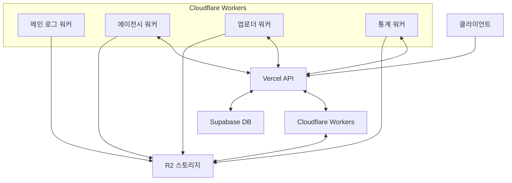

# 메가쇼츠 포인트 시스템 종합 문서

이 문서는 메가쇼츠 포인트 시스템의 전체 구조와 작동 방식을 설명합니다. 포인트 시스템 개선 작업 시 참고할 수 있는 종합적인 가이드입니다.

## 목차

1. [시스템 아키텍처](#1-시스템-아키텍처)
2. [워커 구조](#2-워커-구조)
3. [데이터 처리 흐름](#3-데이터-처리-흐름)
4. [파일 구조 및 저장 전략](#4-파일-구조-및-저장-전략)
5. [포인트 계산 로직](#5-포인트-계산-로직)
6. [자격 변경 로직](#6-자격-변경-로직)
7. [API 엔드포인트](#7-api-엔드포인트)
8. [환경 설정](#8-환경-설정)
9. [개선 및 확장 방안](#9-개선-및-확장-방안)
10. [오류 처리 및 디버깅](#10-오류-처리-및-디버깅)
11. [로컬 개발 환경](#11-로컬-개발-환경)

## 1. 시스템 아키텍처

메가쇼츠 포인트 시스템은 Cloudflare Workers를 기반으로 하는 서버리스 아키텍처로 구현되어 있습니다. 주요 구성 요소는 다음과 같습니다:

### 1.1 핵심 컴포넌트

- **Cloudflare Workers**: 서버리스 실행 환경으로, 정기적인 작업 및 API 요청 처리
- **R2 스토리지**: 포인트 계산 결과, 정산 내역, 설정 등의 데이터 저장
- **Supabase**: 사용자 정보, 시청 기록 등의 데이터베이스 역할
- **Vercel API**: 포인트 적용 및 사용자 정보 조회를 위한 연동 지점

### 1.2 시스템 구성도



### 워커 실행 순서와 역할
1. 에이전시 워커 (agency-points)
- 매일 자정에 스케줄러에 의해 가장 먼저 실행됩니다.
- 주요 역할: 일일 시청 데이터 수집 및 포인트 계산, 주간 정산 처리(일요일)
- 실행 과정:
  1) 시스템 설정 동기화: Vercel API(/api/agency/settings-export)를 호출하여 시스템 설정을 가져와 system-settings.json 파일로 R2에 저장
  2) 일일 데이터 수집: Vercel API(/api/agency/views-export)를 호출하여 전일 시청 기록을 가져와 daily-views/{날짜}.json와 referral-structure/{날짜}.json 파일로 R2에 저장
  3) 일일 포인트 계산: 수집된 데이터를 기반으로 포인트 계산 후 daily-points/{날짜}.json 파일로 R2에 저장
  4) 일요일인 경우 주간 정산 처리: 지난 주 데이터를 기반으로 정산 후 weekly-settlements/{연도}-W{주차}.json 파일로 R2에 저장

2. 업로더 워커 (uploader-points)
- 에이전시 워커 실행 완료 후 실행됩니다.
- 주요 역할: 업로더 포인트 정산 및 레벨 변경 처리(일요일)
- 실행 과정:
  1) 에이전시 워커가 생성한 daily-points/{날짜}.json 파일을 읽어 업로더별 포인트 계산
  2) 일요일인 경우 주간 정산 처리: 지난 주 데이터를 기반으로 정산 후 weekly-uploader-settlements/{연도}-W{주차}.json와 weekly-post-earnings/{연도}-W{주차}.json 파일로 R2에 저장
  3) 업로더 레벨 변경 처리: 정산 결과를 기반으로 레벨 변경 후 uploader-level-changes/{연도}-W{주차}.json 파일로 R2에 저장

3. 통계 워커 (stats-api)
- 스케줄러에 의해 실행되지 않고, HTTP 요청에 의해 실행됩니다.
- 주요 역할: 에이전시 워커와 업로더 워커가 생성한 데이터를 기반으로 통계 정보 제공
- 실행 과정:
  1) 요청에 따라 R2에서 관련 파일을 읽어 통계 정보 제공
  2) 파일을 생성하지 않고 조회 결과만 반환

## 2. 워커 구조

포인트 시스템은 다음과 같은 워커들로 구성되어 있습니다:

### 2.1 메인 로그 워커 (megashorts-logs)

- **역할**: 로그 데이터 수집 및 DuckDB 변환
- **실행 주기**: 매일 자정 (한국 시간)
- **주요 기능**: 
  - 일일 로그 데이터 수집
  - JSON 파일을 DuckDB 형식으로 변환
  - 오래된 로그 파일 정리

### 2.2 에이전시 워커 (agency-points)

- **역할**: 에이전시 관련 포인트 처리
- **실행 주기**: 매일 자정 (한국 시간)
- **주요 기능**:
  - 일일 시청 데이터 수집
  - 일일 포인트 계산
  - 주간 정산 처리 (일요일)
  - 에이전시 자격 변경 처리

### 2.3 업로더 워커 (uploader-points)

- **역할**: 업로더 관련 포인트 처리
- **실행 주기**: 매일 자정 (한국 시간)
- **주요 기능**:
  - 주간 정산 처리 (일요일)
  - 포스트별 수익 발생 기록 생성
  - 업로더 레벨 변경 처리

### 2.4 통계 워커 (stats-api)

- **역할**: 통계 데이터 제공 및 API 처리
- **실행 주기**: 요청 시 (HTTP)
- **주요 기능**:
  - 업로더 통계 조회
  - 에이전시 통계 조회
  - 관리자 통계 조회
  - 포인트 지급 신청 처리
  - 지급 내역 조회

## 3. 데이터 처리 흐름

포인트 시스템의 데이터 처리 흐름은 다음과 같습니다:

### 3.1 일일 데이터 수집 및 처리

1. **시청 데이터 수집**:
   - 에이전시 워커가 Vercel API를 통해 전일 시청 기록 데이터 요청
   - 수집된 데이터를 `daily-views/{날짜}.json` 파일로 저장
   - 추천인 구조 데이터를 `referral-structure/{날짜}.json` 파일로 저장

2. **포인트 계산**:
   - 시청 데이터를 기반으로 사용자별 포인트 계산
   - 계산 결과를 `daily-points/{날짜}.json` 파일로 저장

### 3.2 주간 정산 처리

1. **에이전시 정산**:
   - 지난 주 일일 포인트 계산 결과 로드
   - 사용자별 소수점 이하 잔액 로드
   - 마스터 설정 및 추천인 구조 로드
   - 포인트 분배 계산 (마스터 타입별 로직 적용)
   - 결과를 `weekly-settlements/{연도}-W{주차}.json` 파일로 저장
   - Vercel API를 통해 포인트 업데이트

2. **업로더 정산**:
   - 지난 주 일일 포인트 계산 결과 로드
   - 업로더별 소수점 이하 잔액 로드
   - 시스템 설정 로드
   - 구독 포인트 풀 계산
   - 업로더 레벨에 따른 포인트 분배 계산
   - 결과를 `weekly-uploader-settlements/{연도}-W{주차}.json` 파일로 저장
   - 포스트별 수익 발생 기록 생성
   - Vercel API를 통해 포인트 업데이트

### 3.3 자격 변경 처리

1. **업로더 레벨 변경**:
   - 주간 정산 결과를 기반으로 업로더별 통계 계산
   - 레벨 변경 조건 확인
   - 레벨 변경이 있는 경우 Vercel API를 통해 업데이트
   - 변경 내역을 `uploader-level-changes/{연도}-W{주차}.json` 파일로 저장

2. **에이전시 자격 변경**:
   - 주간 정산 결과를 기반으로 에이전시 멤버별 통계 계산
   - 자격 변경 조건 확인
   - 자격 변경이 있는 경우 Vercel API를 통해 업데이트
   - 변경 내역을 `qualification-changes/{연도}-W{주차}.json` 파일로 저장

### 3.4 API 호출 및 데이터 동기화

1. **시스템 설정 동기화**:
   - 에이전시 워커가 Vercel API를 통해 시스템 설정 요청
   - 응답 데이터를 `system-settings.json` 파일로 저장
   - API 호출 실패 시 기존 설정 사용

2. **일일 데이터 수집**:
   - 에이전시 워커가 Vercel API를 통해 일일 시청 데이터 요청
   - 응답 데이터를 `daily-views/{날짜}.json` 및 `referral-structure/{날짜}.json` 파일로 저장
   - API 호출 실패 시 빈 데이터 파일 생성

3. **포인트 적용**:
   - 정산 결과를 Vercel API를 통해 사용자 계정에 적용
   - 적용 실패 시 로그 기록 및 재시도 메커니즘 작동

## 4. 파일 구조 및 저장 전략

포인트 시스템은 R2 스토리지에 다양한 파일을 저장합니다:

### 4.1 일별 파일

| 파일 | 경로 | 내용 | 보관 기간 |
|------|------|------|----------|
| 일일 시청 기록 | `daily-views/{날짜}.json` | 사용자별 시청 기록 | 30일 |
| 일일 포인트 계산 | `daily-points/{날짜}.json` | 사용자별 포인트 계산 | 30일 |
| 추천인 구조 | `referral-structure/{날짜}.json` | 사용자 관계 구조 | 30일 |

### 4.2 주간 파일

| 파일 | 경로 | 내용 | 보관 기간 |
|------|------|------|----------|
| 주간 정산 | `weekly-settlements/{연도}-W{주차}.json` | 에이전시 지급 내역 | 1년 |
| 업로더 정산 | `weekly-uploader-settlements/{연도}-W{주차}.json` | 업로더 지급 내역 | 1년 |
| 포스트별 수익 | `weekly-post-earnings/{연도}-W{주차}.json` | 포스트별 수익 발생 기록 | 1년 |

### 4.3 설정 파일

| 파일 | 경로 | 내용 | 업데이트 주기 |
|------|------|------|-------------|
| 시스템 설정 | `system-settings.json` | 시스템 설정 정보 | 관리자 변경 시 |
| 마스터 설정 | `master-settings.json` | 마스터 설정 정보 | 마스터 변경 시 |
| 사용자 잔액 | `user-remainders.json` | 사용자별 소수점 이하 잔액 | 주간 정산 시 |
| 업로더 잔액 | `uploader-remainders.json` | 업로더별 소수점 이하 잔액 | 주간 정산 시 |

### 4.4 자격 변경 파일

| 파일 | 경로 | 내용 | 생성 주기 |
|------|------|------|----------|
| 자격 변경 | `qualification-changes/{연도}-W{주차}.json` | 자격 변경 내역 | 주간 정산 시 |
| 업로더 레벨 변경 | `uploader-level-changes/{연도}-W{주차}.json` | 업로더 레벨 변경 내역 | 주간 정산 시 |

### 4.5 R2 버킷 구성

포인트 시스템은 다음과 같은 R2 버킷을 사용합니다:

- **points-system-bucket**: 포인트 시스템 관련 데이터 저장
- **logs-bucket**: 로그 데이터 저장

각 버킷은 wrangler.toml 파일에서 다음과 같이 정의됩니다:

```toml
[[r2_buckets]]
binding = "POINTS_BUCKET"
bucket_name = "points-system-bucket"
```

워커 코드에서는 다음과 같이 R2 버킷에 접근합니다:

```typescript
// R2 버킷에 파일 저장
await env.POINTS_BUCKET.put(
  `daily-views/${date}.json`,
  JSON.stringify(data)
);

// R2 버킷에서 파일 읽기
const response = await env.POINTS_BUCKET.get(`system-settings.json`);
if (response) {
  const settings = JSON.parse(await response.text());
  // 설정 사용
}
```

## 5. 포인트 계산 로직

포인트 계산은 다음과 같은 로직으로 이루어집니다:

### 5.1 일일 포인트 계산

```javascript
// 일일 포인트 계산 로직 (간소화)
function calculateDailyPoints(videoViews, systemSettings) {
  const dailyPoints = [];
  
  // 사용자별로 그룹화
  const userVideoViews = groupByUser(videoViews);
  
  // 각 사용자별 포인트 계산
  for (const userId in userVideoViews) {
    const userViews = userVideoViews[userId];
    let totalPoints = 0;
    const sourceData = [];
    
    for (const view of userViews) {
      // 접근 방식에 따른 포인트 계산
      let pointsPerView = 0;
      
      switch (view.accessMethod) {
        case 'FREE':
          pointsPerView = 0; // 무료 시청은 포인트 없음
          break;
        case 'SUBSCRIPTION':
          // 구독 시청은 주간 구독료 기준으로 계산 (실제 계산은 주간 정산에서 수행)
          pointsPerView = 0.5; // 임시값, 주간 정산에서 재계산됨
          break;
        case 'COIN':
          // 코인 시청은 설정된 코인 수량 및 환산 비율로 계산
          pointsPerView = systemSettings.viewCoinAmount * systemSettings.coinToPoint;
          break;
      }
      
      const viewPoints = pointsPerView * view.viewCount;
      totalPoints += viewPoints;
      
      sourceData.push({
        videoId: view.videoId,
        postId: view.postId,
        accessMethod: view.accessMethod,
        viewCount: view.viewCount,
        pointsGenerated: viewPoints
      });
    }
    
    dailyPoints.push({
      userId,
      uploaderId: userViews[0]?.uploaderId || '',
      calculatedPoints: totalPoints,
      sourceData,
      timestamp: new Date().toISOString()
    });
  }
  
  return dailyPoints;
}
```

### 5.2 에이전시 주간 정산

에이전시 주간 정산은 다음과 같은 단계로 이루어집니다:

1. **사용자별 총 포인트 계산**:
   - 지난 주 일일 포인트 계산 결과에서 사용자별 포인트 합산
   - 이전 잔액 포함한 총 포인트 계산
   - 지급할 정수 포인트 계산 (내림 사용)
   - 이월할 소수점 이하 잔액 계산

2. **포인트 분배 계산**:
   - 추천인 체인 구성
   - 마스터 찾기 (역할이 TEAM_MASTER인 사용자)
   - 마스터 타입별 포인트 분배 로직 적용
     - 본부구조 (HEADQUARTERS)
     - 네트워크 (NETWORK)
     - 바이너리 네트워크 (BINARY_NETWORK)

### 5.3 업로더 주간 정산

업로더 주간 정산은 다음과 같은 단계로 이루어집니다:

1. **업로더별 총 포인트 계산**:
   - 코인 시청 포인트 계산
   - 구독 시청 포인트 계산
   - 이전 잔액 포함한 총 포인트 계산
   - 지급할 정수 포인트 계산 (내림 사용)
   - 이월할 소수점 이하 잔액 계산

2. **구독 포인트 풀 계산**:
   ```javascript
   // 구독 포인트 풀 계산
   const subscriptionPool = 
     (weeklySubscribers * systemSettings.weeklySubscriptionFee) + 
     (yearlySubscribers * (systemSettings.yearlySubscriptionFee / 52));
   
   // 구독 시청 1회당 포인트 계산
   const pointsPerSubscriptionView = totalSubscriptionViews > 0 ? 
     subscriptionPool / totalSubscriptionViews : 0;
   ```

3. **업로더 레벨에 따른 지급 비율 적용**:
   ```javascript
   // 업로더 레벨에 따른 지급 비율 계산
   function getUploaderShareRatio(level, systemSettings) {
     switch (level) {
       case 1: return systemSettings.uploaderShareRatios.level1;
       case 2: return systemSettings.uploaderShareRatios.level2;
       case 3: return systemSettings.uploaderShareRatios.level3;
       case 4: return systemSettings.uploaderShareRatios.level4;
       case 5: return systemSettings.uploaderShareRatios.level5;
       default: return systemSettings.uploaderShareRatios.level1;
     }
   }
   
   // 실제 지급할 포인트 계산
   const grantedAmount = Math.floor(pointsToGrant * (shareRatio / 100));
   ```

## 6. 자격 변경 로직

자격 변경 로직은 주간 정산 후에 처리됩니다:

### 6.1 업로더 레벨 변경

업로더 레벨 변경은 다음과 같은 조건으로 이루어집니다:

```javascript
// 레벨 상향 조건 확인
if (currentLevel < 5) {
  if (currentLevel === 4 && stats.totalViews >= levelCriteria.level5.views) {
    newLevel = 5;
  } else if (currentLevel === 3 && stats.totalViews >= levelCriteria.level4.views) {
    newLevel = 4;
  } else if (currentLevel === 2 && stats.totalViews >= levelCriteria.level3.views) {
    newLevel = 3;
  } else if (currentLevel === 1 && stats.totalViews >= levelCriteria.level2.views) {
    newLevel = 2;
  }
}
```

레벨 기준은 다음과 같습니다:
- 레벨 2: 100회 이상 시청
- 레벨 3: 500회 이상 시청
- 레벨 4: 1,000회 이상 시청
- 레벨 5: 5,000회 이상 시청

### 6.2 에이전시 자격 변경

에이전시 자격 변경은 마스터 타입별로 다른 조건으로 이루어집니다:

#### 6.2.1 네트워크 마스터 자격 변경

```javascript
// 네트워크 자격 변경 로직
if (masterType === 'NETWORK') {
  if (settings.network?.autoQualification.enabled) {
    const autoQualification = settings.network.autoQualification;
    
    // 자격 조건 확인
    let qualifies = false;
    
    switch (autoQualification.useCondition) {
      case 'memberCount':
        qualifies = stats.memberCount >= autoQualification.memberCount;
        break;
      case 'chargeAmount':
        qualifies = stats.chargeAmount >= autoQualification.chargeAmount;
        break;
      case 'usageAmount':
        qualifies = stats.usageAmount >= autoQualification.usageAmount;
        break;
      case 'both':
        qualifies = stats.memberCount >= autoQualification.memberCount && 
                   stats.chargeAmount >= autoQualification.chargeAmount;
        break;
    }
    
    if (qualifies) {
      // 매니저 자격 부여
      // ...
    }
  }
}
```

## 7. API 엔드포인트

포인트 시스템은 다양한 API 엔드포인트를 제공합니다:

### 7.1 에이전시 API

| 엔드포인트 | 메소드 | 기능 | 파라미터 |
|-----------|-------|------|----------|
| `/api/agency/settings` | GET | 마스터 설정 조회 | `userId` |
| `/api/agency/settings` | POST | 마스터 설정 저장 | `settings` |
| `/api/agency/distributions` | GET | 포인트 분배 내역 조회 | `userId`, `year`, `week` |
| `/api/agency/structure` | GET | 추천인 구조 조회 | `userId` |
| `/api/agency/trigger-settlement` | POST | 수동 정산 트리거 | `startDate`, `endDate` |
| `/api/agency/views-export` | POST | 일일 시청 데이터 내보내기 | `date` |
| `/api/agency/settings-export` | POST | 시스템 설정 내보내기 | - |
| `/api/agency/points-apply` | POST | 에이전시 포인트 적용 | `userId`, `points` |

### 7.2 업로더 API

| 엔드포인트 | 메소드 | 기능 | 파라미터 |
|-----------|-------|------|----------|
| `/api/uploader/earnings` | GET | 업로더 포인트 내역 조회 | `userId`, `year`, `week` |
| `/api/uploader/post-earnings` | GET | 포스트별 수익 내역 조회 | `uploaderId` 또는 `postId`, `year`, `week` |
| `/api/uploader/trigger-settlement` | POST | 수동 정산 트리거 | `startDate`, `endDate` |
| `/api/uploader/points-apply` | POST | 업로더 포인트 적용 | `userId`, `points` |
| `/api/uploader/user-info` | GET | 업로더 정보 조회 | `userId` |
| `/api/uploader/uploader-level` | GET | 업로더 레벨 조회 | `userId` |
| `/api/uploader/update-uploader-level` | POST | 업로더 레벨 업데이트 | `userId`, `level` |

### 7.3 통계 API

| 엔드포인트 | 메소드 | 기능 | 파라미터 |
|-----------|-------|------|----------|
| `/api/stats/uploader` | GET | 업로더 통계 조회 | `userId` |
| `/api/stats/agency` | GET | 에이전시 통계 조회 | `userId` |
| `/api/stats/admin` | GET | 관리자 통계 조회 | - |
| `/api/points/apply` | POST | 포인트 지급 신청 | `userId`, `amount`, `bankInfo` |
| `/api/points/payments` | GET | 지급 내역 조회 | `userId` |
| `/api/points/applications` | GET | 지급 신청 내역 조회 | `userId` |
| `/api/points/admin/withdrawals` | GET | 관리자용 출금 내역 조회 | - |
| `/api/points/admin/withdrawals/{id}/approve` | POST | 출금 승인 | `id` |
| `/api/points/admin/withdrawals/{id}/reject` | POST | 출금 거절 | `id` |
| `/api/points/admin/withdrawals/{id}/memo` | POST | 출금 메모 추가 | `id`, `memo` |

## 8. 환경 설정

포인트 시스템은 다음과 같은 환경 변수를 사용합니다:

```toml
# wrangler.toml 파일 예시
name = "agency-points"
main = "index.ts"
compatibility_date = "2024-09-23"
compatibility_flags = ["nodejs_compat"]

[[r2_buckets]]
binding = "POINTS_BUCKET"
bucket_name = "points-system-bucket"

[triggers]
crons = ["0 15 * * *"]  # 매일 UTC 15:00 (한국 시간 자정)에 실행

# 환경변수 설정
[vars]
CLOUDFLARE_ACCOUNT_ID = "923201050a960d4c64fb9b90a88cb956"
CLOUDFLARE_API_TOKEN = "9bbfwbK3M7KBwvsXt5GZyxg-V0cJihg5VaharweT"
CLOUDFLARE_API_EMAIL = "msdevcm@gmail.com"
CLOUDFLARE_R2_TOKEN = "f9A6HRhU4LnUdq4xPcOSrMKsJcUMmr24sjM-2Nlq"
CLOUDFLARE_R2_ACCESS_KEY_ID = "6f822cce92f2063990912c24f3456cd8"
CLOUDFLARE_R2_SECRET_ACCESS_KEY = "6fbcd96be5b4232747f47885aba1c8b3edd8c78c66165b067ae9aaf49368bfb0"
API_BASE_URL = "https://megashorts.com/api/agency"
CRON_SECRET = "asdgasdfhasfdhsdfhsdfjhs"
```

### 8.1 개발 환경 설정

개발 환경에서는 다음과 같은 설정을 사용합니다:

```toml
# 개발 환경 설정
[env.dev]
[env.dev.vars]
API_BASE_URL = "http://localhost:3000/api/agency"
CLOUDFLARE_ACCOUNT_ID = "923201050a960d4c64fb9b90a88cb956"
CLOUDFLARE_API_TOKEN = "9bbfwbK3M7KBwvsXt5GZyxg-V0cJihg5VaharweT"
CLOUDFLARE_API_EMAIL = "msdevcm@gmail.com"
CLOUDFLARE_R2_TOKEN = "f9A6HRhU4LnUdq4xPcOSrMKsJcUMmr24sjM-2Nlq"
CLOUDFLARE_R2_ACCESS_KEY_ID = "6f822cce92f2063990912c24f3456cd8"
CLOUDFLARE_R2_SECRET_ACCESS_KEY = "6fbcd96be5b4232747f47885aba1c8b3edd8c78c66165b067ae9aaf49368bfb0"
CRON_SECRET = "asdgasdfhasfdhsdfhsdfjhs"

# R2 버킷 설정 (개발 환경용)
[[env.dev.r2_buckets]]
binding = "POINTS_BUCKET"
bucket_name = "points-system-bucket"
```

===========
===========

# 메가쇼츠 포인트 시스템 로컬 개발 환경

이 문서는 메가쇼츠 포인트 시스템의 로컬 개발 환경 설정 및 사용 방법에 대해 설명합니다.

## 목차

1. [개발 환경 설정](#1-개발-환경-설정)
2. [Wrangler 명령어](#2-wrangler-명령어)
3. [로컬 R2 버킷 에뮬레이션](#3-로컬-r2-버킷-에뮬레이션)
4. [로컬 테스트 및 디버깅](#4-로컬-테스트-및-디버깅)
5. [개발 환경과 프로덕션 환경의 차이점](#5-개발-환경과-프로덕션-환경의-차이점)
6. [일반적인 문제 해결](#6-일반적인-문제-해결)

## 1. 개발 환경 설정

### 1.1 필수 도구 설치

포인트 시스템 개발을 위해 다음 도구가 필요합니다:

- **Node.js**: v16 이상
- **npm**: v7 이상
- **Wrangler CLI**: Cloudflare Workers 개발 도구

```bash
# Wrangler CLI 설치
npm install -g wrangler
```

### 1.2 프로젝트 클론 및 설정

```bash
# 프로젝트 클론
git clone https://github.com/your-org/megashorts-logs.git
cd megashorts-logs

# 의존성 설치
npm install

# 환경 변수 설정
cp .dev.vars.example .dev.vars
```

`.dev.vars` 파일을 편집하여 필요한 환경 변수를 설정합니다:

```
CLOUDFLARE_ACCOUNT_ID=your-account-id
CLOUDFLARE_API_TOKEN=your-api-token
CLOUDFLARE_API_EMAIL=your-email
CLOUDFLARE_R2_TOKEN=your-r2-token
CLOUDFLARE_R2_ACCESS_KEY_ID=your-r2-access-key-id
CLOUDFLARE_R2_SECRET_ACCESS_KEY=your-r2-secret-access-key
API_BASE_URL=http://localhost:3000/api/agency
CRON_SECRET=your-cron-secret
```

### 1.3 wrangler.toml 설정

각 워커 디렉토리(`src/agency`, `src/stats`, `src/uploader`)에는 `wrangler.toml` 파일이 있습니다. 이 파일은 워커의 설정을 정의합니다:

```toml
name = "agency-points"
main = "index.ts"
compatibility_date = "2024-09-23"
compatibility_flags = ["nodejs_compat"]

[[r2_buckets]]
binding = "POINTS_BUCKET"
bucket_name = "points-system-bucket"

[triggers]
crons = ["0 15 * * *"]  # 매일 UTC 15:00 (한국 시간 자정)에 실행

# 환경변수 설정
[vars]
# 기본 환경 변수 (프로덕션)

# 개발 환경 설정
[env.dev]
[env.dev.vars]
API_BASE_URL = "http://localhost:3000/api/agency"
# 개발 환경 변수

# R2 버킷 설정 (개발 환경용)
[[env.dev.r2_buckets]]
binding = "POINTS_BUCKET"
bucket_name = "points-system-bucket"
```

## 2. Wrangler 명령어

### 2.1 로컬 개발 서버 실행

```bash
# 기본 환경으로 실행
cd src/agency
npx wrangler dev --local

# 개발 환경으로 실행
cd src/agency
npx wrangler dev --local --env dev
```

### 2.2 스케줄된 작업 수동 실행

```bash
# 스케줄된 작업 수동 실행
curl -X POST "http://localhost:8787/__scheduled"

# 특정 포트에서 실행 중인 경우
curl -X POST "http://localhost:62720/__scheduled"
```

### 2.3 배포

```bash
# 프로덕션 환경에 배포
cd src/agency
npx wrangler deploy

# 개발 환경에 배포
cd src/agency
npx wrangler deploy --env dev
```

### 2.4 로그 확인

```bash
# 실시간 로그 확인
npx wrangler tail
```

## 3. 로컬 R2 버킷 에뮬레이션

Wrangler는 로컬 개발 환경에서 R2 버킷을 에뮬레이션합니다. 로컬 R2 버킷은 `.wrangler` 디렉토리에 SQLite 데이터베이스로 저장됩니다.

### 3.1 로컬 R2 버킷 위치

로컬 R2 버킷 데이터는 다음 위치에 저장됩니다:

```
.wrangler/state/v3/r2/miniflare-R2BucketObject/{hash}.sqlite
```

### 3.2 로컬 R2 버킷 데이터 확인

SQLite 명령어를 사용하여 로컬 R2 버킷 데이터를 확인할 수 있습니다:

```bash
# SQLite 설치 (macOS)
brew install sqlite

# 테이블 목록 확인
sqlite3 .wrangler/state/v3/r2/miniflare-R2BucketObject/{hash}.sqlite ".tables"

# 객체 목록 확인
sqlite3 .wrangler/state/v3/r2/miniflare-R2BucketObject/{hash}.sqlite "SELECT * FROM objects LIMIT 10;"
```

### 3.3 로컬 R2 버킷 초기화

로컬 R2 버킷을 초기화하려면 `.wrangler` 디렉토리를 삭제하면 됩니다:

```bash
rm -rf .wrangler
```

## 4. 로컬 테스트 및 디버깅

### 4.1 로컬 API 서버 설정

포인트 시스템은 Vercel API와 통신합니다. 로컬 개발 환경에서는 로컬 API 서버를 사용합니다:

1. 메인 프로젝트(Vercel)를 로컬에서 실행:
   ```bash
   cd /path/to/main-project
   npm run dev
   ```

2. `.dev.vars` 또는 `wrangler.toml`에서 API 기본 URL을 로컬 서버로 설정:
   ```
   API_BASE_URL=http://localhost:3000/api/agency
   ```

### 4.2 디버깅 방법

#### 4.2.1 콘솔 로그

워커 코드에 `console.log`, `console.error` 등을 추가하여 디버깅할 수 있습니다:

```typescript
console.log('데이터 처리 시작:', data);
try {
  // 코드 실행
} catch (error) {
  console.error('오류 발생:', error);
}
```

로그는 Wrangler 개발 서버 콘솔에 출력됩니다.

#### 4.2.2 개발자 도구

Wrangler 개발 서버는 브라우저 개발자 도구를 제공합니다:

1. 개발 서버 실행 시 `[d] open devtools` 옵션 선택
2. 브라우저에서 개발자 도구 열기
3. 소스 탭에서 중단점 설정 및 디버깅

### 4.3 테스트 데이터 생성

테스트 데이터를 생성하여 포인트 시스템을 테스트할 수 있습니다:

```typescript
// 테스트 시청 데이터 생성
const testVideoViews = [
  {
    userId: 'user1',
    uploaderId: 'uploader1',
    postId: 'post1',
    videoId: 'video1',
    viewCount: 10,
    accessMethod: 'COIN'
  },
  // 추가 테스트 데이터
];

// R2에 테스트 데이터 저장
await env.POINTS_BUCKET.put(
  `daily-views/2025-03-05.json`,
  JSON.stringify(testVideoViews)
);
```

## 5. 개발 환경과 프로덕션 환경의 차이점

### 5.1 환경 변수

개발 환경과 프로덕션 환경은 다음과 같은 차이가 있습니다:

| 항목 | 개발 환경 | 프로덕션 환경 |
|------|----------|-------------|
| API 기본 URL | `http://localhost:3000/api/agency` | `https://megashorts.com/api/agency` |
| R2 버킷 | 로컬 에뮬레이션 | 실제 Cloudflare R2 버킷 |
| 스케줄 실행 | 수동 트리거 | 자동 스케줄 실행 |
| 오류 처리 | 개발 모드 오류 허용 | 엄격한 오류 처리 |

### 5.2 오류 처리 차이

개발 환경에서는 일부 오류를 허용하여 개발 및 테스트를 용이하게 합니다:

```typescript
try {
  // API 호출 또는 R2 작업
} catch (error) {
  console.error(`오류 발생:`, error);
  
  // 개발 환경에서는 오류를 무시하고 계속 진행
  if (process.env.NODE_ENV === 'development') {
    console.log(`개발 환경에서는 오류를 무시하고 계속 진행합니다.`);
    return true;
  }
  
  // 프로덕션 환경에서는 오류 발생 시 중단
  throw error;
}
```

### 5.3 API 호출 실패 처리

개발 환경에서 API 호출 실패 시 빈 데이터를 생성하여 계속 진행할 수 있습니다:

```typescript
try {
  // API 호출 시도
  const response = await fetch(`${getApiBaseUrl(env)}/views-export`, {
    method: 'POST',
    headers: {
      'Content-Type': 'application/json',
      'Authorization': `Bearer ${env.CRON_SECRET}`
    },
    body: JSON.stringify({ date })
  });
  
  // 응답 처리
} catch (apiError) {
  console.warn(`API 호출 실패:`, apiError);
  
  // 빈 데이터 파일 생성
  const emptyData = [];
  await env.POINTS_BUCKET.put(
    `daily-views/${date}.json`, 
    JSON.stringify(emptyData)
  );
  
  return true;
}
```

## 6. 일반적인 문제 해결

### 6.1 R2 버킷 접근 오류

**문제**: R2 버킷 접근 시 403 Forbidden 오류 발생

**해결 방법**:
1. 환경 변수 확인: `CLOUDFLARE_R2_ACCESS_KEY_ID`, `CLOUDFLARE_R2_SECRET_ACCESS_KEY` 값이 올바른지 확인
2. 버킷 이름 확인: `wrangler.toml`의 `bucket_name`과 코드에서 사용하는 버킷 이름이 일치하는지 확인
3. 권한 확인: Cloudflare 대시보드에서 R2 버킷 접근 권한 확인

### 6.2 API 호출 오류

**문제**: Vercel API 호출 시 오류 발생

**해결 방법**:
1. API 기본 URL 확인: `API_BASE_URL` 환경 변수가 올바른지 확인
2. 인증 토큰 확인: `CRON_SECRET` 환경 변수가 올바른지 확인
3. 로컬 API 서버 실행 확인: 로컬 개발 환경에서 API 서버가 실행 중인지 확인

### 6.3 스케줄 실행 오류

**문제**: 스케줄된 작업이 실행되지 않음

**해결 방법**:
1. 수동 트리거 확인: `curl -X POST "http://localhost:8787/__scheduled"` 명령으로 수동 실행
2. 로그 확인: 실행 중 오류가 있는지 로그 확인
3. 스케줄 설정 확인: `wrangler.toml`의 `crons` 설정이 올바른지 확인

### 6.4 환경 변수 로드 오류

**문제**: 환경 변수가 로드되지 않음

**해결 방법**:
1. `.dev.vars` 파일 확인: 파일이 존재하고 올바른 형식인지 확인
2. Wrangler 실행 옵션 확인: `--env dev` 옵션을 사용하여 개발 환경 변수 로드
3. 환경 변수 직접 설정: `npx wrangler dev --local --env dev --var KEY=VALUE`

### 6.5 로컬 R2 버킷 데이터 초기화

**문제**: 로컬 R2 버킷 데이터를 초기화하고 싶음

**해결 방법**:
1. `.wrangler` 디렉토리 삭제: `rm -rf .wrangler`
2. 개발 서버 재시작: `npx wrangler dev --local --env dev`
