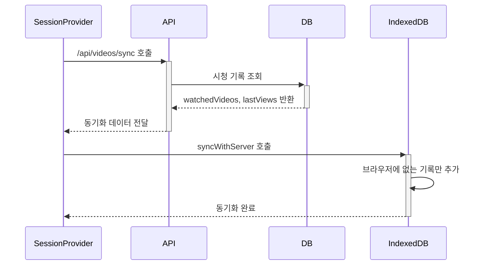

# 시청 기록 동기화 시스템

## 개요
브라우저와 서버 간의 시청 기록을 동기화하는 시스템입니다. 새로운 브라우저에서 로그인하거나, 다른 브라우저에서 추가된 시청 기록을 현재 브라우저에 반영하는 역할을 합니다.

## 시청 기록 관리

### 저장 조건
- sequence > 1인 비디오만 저장 (첫 번째 영상은 제외)
- 5초 이상 시청한 경우에만 저장
- 이후 10초 단위로 진행 상태 업데이트
- 브라우저의 IndexedDB와 서버의 DB에 모두 저장
- 유료 동영상의 경우만 서버에 저장

### 시청 기록 생성 (VideoPlayer)
```typescript
// 5초 도달 시 첫 저장
if (currentTime >= 5 && lastTrackedTimeRef.current === 0) {
  // 브라우저 저장
  await Promise.all([
    videoDB.saveWatchedVideo(videoId),
    videoDB.saveLastView(postId, sequence, currentTime)
  ]);
  
  // 유료 동영상일 때만 서버 저장
  if (isPremium) {
    await fetch('/api/videos/view', {
      method: 'POST',
      body: JSON.stringify({
        videoId,
        postId,
        sequence,
        timestamp: currentTime
      })
    });
  }
}

// 이후 10초 단위로 저장
if (currentTime >= 10) {
  const nextCheckpoint = Math.floor(currentTime / 10) * 10;
  if (nextCheckpoint > lastTrackedTimeRef.current) {
    await videoDB.saveLastView(postId, sequence, nextCheckpoint);
  }
}
```

### 활용
- 추천 페이지에서 시청한 포스트 필터링
- 비디오 플레이어에서 이어보기 기능
- 시청 진행률 표시

## 핵심 컴포넌트

### 1. SessionProvider (src/components/SessionProvider.tsx)
- 역할: 세션 상태 관리 및 시청 기록 동기화 트리거
- 동작 시점:
  - 앱 시작 시 세션 체크
  - 로그인/로그아웃 시
  - 사용자 변경 시
  - 페이지 새로고침 시

```typescript
// 사용자 변경 감지 및 동기화 트리거
useEffect(() => {
  if (currentUserId) {
    // 다른 사용자 로그인 시 초기화
    if (prevUserId && currentUserId !== prevUserId) {
      await videoDB.clearForNewUser();
    }
    // 동기화 실행
    const res = await fetch('/api/videos/sync');
    const data = await res.json();
    await videoDB.syncWithServer(data);
  }
}, [value.user?.id]);
```

### 2. 동기화 API (src/app/(main)/api/videos/sync/route.ts)
- 역할: 서버의 시청 기록 조회
- 데이터 출처: 
  - VideoView 테이블: 시청한 동영상 목록
  - UserVideoProgress 테이블: 포스트별 마지막 시청 정보

```typescript
// 시청 기록 조회
const watchedVideos = await prisma.videoView.findMany({
  where: { userId: user.id },
  select: { videoId: true }
});

// 포스트별 마지막 시청 정보 조회
const lastViews = await prisma.userVideoProgress.findMany({
  where: { userId: user.id },
  select: {
    postId: true,
    lastVideoSequence: true
  }
});
```

### 3. IndexedDB 관리자 (src/lib/indexedDB.ts)
- 역할: 브라우저의 시청 기록 저장소 관리
- 저장소 구조:
  - watchedVideos: 시청한 동영상 ID 목록
  - lastViews: 포스트별 마지막 시청 정보

```typescript
interface VideoViewStore {
  watchedVideos: { videoId: string }[];
  lastViews: {
    postId: string;
    sequence: number;
    timestamp: number;
  }[];
}
```

## 데이터베이스 스키마

### VideoView
```prisma
// 시청한 동영상 기록
model VideoView {
  id        String   @id @default(cuid())
  userId    String   // 사용자 ID
  videoId   String   // 시청한 비디오 ID
  createdAt DateTime @default(now())

  @@unique([userId, videoId])
}
```

### UserVideoProgress
```prisma
// 포스트별 시청 진행 상태
model UserVideoProgress {
  id               String   @id @default(cuid())
  userId           String   // 사용자 ID
  postId           String   // 포스트 ID
  lastVideoSequence Int     // 마지막으로 본 비디오 순서
  updatedAt        DateTime @updatedAt

  @@unique([userId, postId])
}
```

## 동기화 프로세스

1. 초기화 조건
- 새 브라우저에서 첫 로그인
- 다른 사용자로 로그인
- 페이지 새로고침

2. 동기화 순서


3. 데이터 처리
- 브라우저에 없는 시청 기록만 추가
- 기존 브라우저 데이터는 유지
- timestamp는 브라우저에서만 관리

## 주의사항
1. 동기화는 로그인 상태에서만 실행
2. 사용자 변경 시 기존 데이터 초기화 필수
3. 서버 데이터가 브라우저보다 우선
4. 불필요한 중복 동기화 방지
5. sequence=1인 비디오는 시청 기록에서 제외
6. 5초 미만 시청은 기록하지 않음
7. 유료 동영상만 서버에 시청 기록 저장

## 관련 파일
- src/components/SessionProvider.tsx: 동기화 트리거
- src/app/(main)/api/videos/sync/route.ts: 동기화 API
- src/lib/indexedDB.ts: 브라우저 저장소 관리
- src/components/videos/VideoPlayer.tsx: 시청 기록 생성
- prisma/schema.prisma: 데이터베이스 스키마
