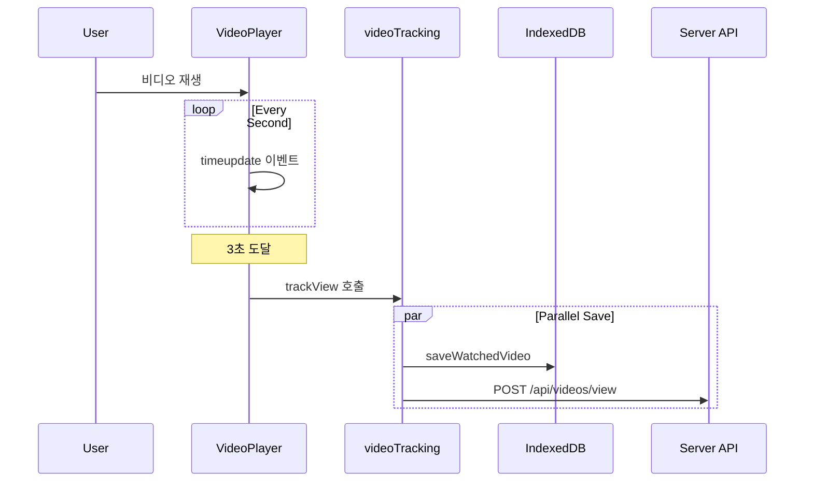
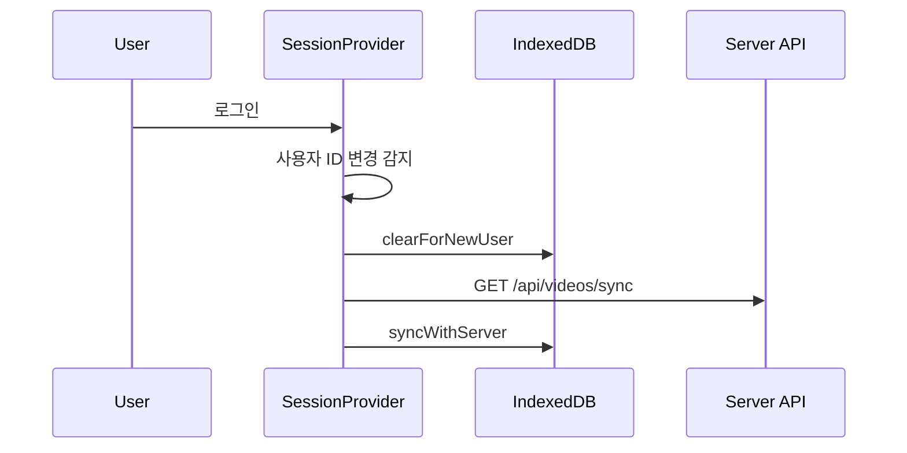
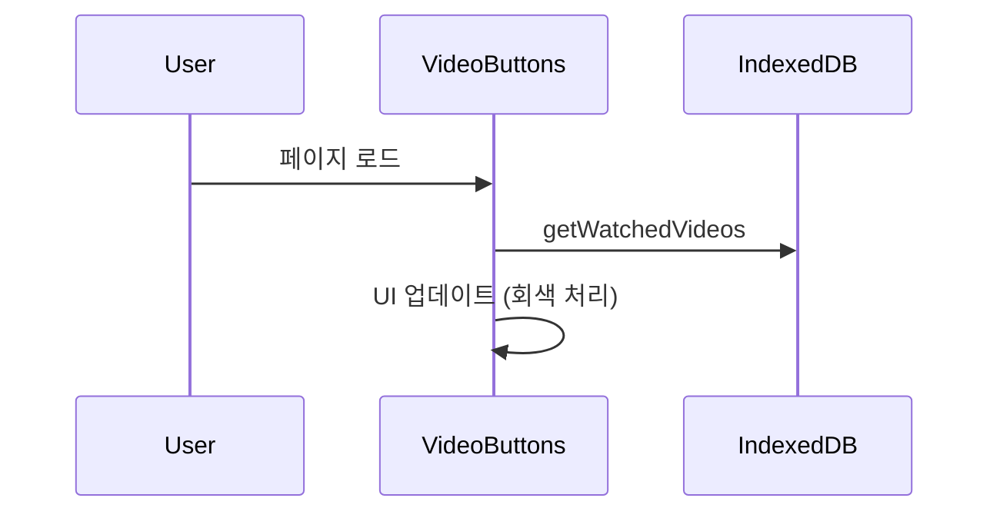

# 동영상 시청 기록 시스템 설계 문서

## 1. 개요

이 문서는 동영상 시청 기록의 저장, 동기화, 관리 시스템의 전체 흐름을 설명합니다.

## 2. 핵심 컴포넌트 및 역할

### 2.1 클라이언트 컴포넌트
- `VideoPlayer.tsx`
  - 실제 비디오 재생 담당
  - timeupdate 이벤트로 재생 시간 추적 (매 초마다)
  - 3초 이상 시청 시 videoTracking.trackView 호출
  - 재생 시간을 10초 단위로 저장

- `VideoButtons.tsx`
  - 시청 기록에 따른 UI 표시 (회색 처리)
  - IndexedDB에서 시청 기록 확인
  - 페이지 로드 시와 visibility 변경 시 기록 확인

- `SessionProvider.tsx`
  - 사용자 세션 관리
  - 로그인/로그아웃 감지
  - 사용자 변경 시 시청 기록 동기화 처리

### 2.2 유틸리티
- `videoTracking.ts`
  - 시청 기록 추적 로직 중앙 관리
  - 브라우저와 서버 저장 동시 처리
  - 시청 시간 검증 (3초 이상)

- `indexedDB.ts`
  - 브라우저 로컬 저장소 관리
  - watchedVideos 스토어: 시청한 비디오 ID
  - lastViews 스토어: 마지막 시청 정보
  - 사용자별 데이터 초기화 기능

### 2.3 API
- `videos/view/route.ts`
  - 시청 기록 서버 저장 처리
  - 무료/프리미엄 영상 구분
  - 구독 상태 확인
  - VideoView 테이블 관리
  - UserVideoProgress 테이블 업데이트

- `videos/sync/route.ts`
  - 시청 기록 동기화 API
  - 사용자별 시청 기록 조회
  - 첫 번째 영상(sequence: 1) 제외

## 3. 데이터 흐름

### 3.1 시청 시작 시
1. `VideoPlayer.tsx` → `videoTracking.ts`
   ```typescript
   // 1. 시청 시간 추적
   video.addEventListener('timeupdate', handleTimeUpdate);
   
   // 2. 3초 도달 시 기록
   if (currentTime >= 3 && lastTrackedTimeRef.current === 0) {
     videoTracking.trackView({
       videoId,
       postId,
       sequence,
       timestamp: currentTime
     });
   }
   ```

2. `videoTracking.ts` → `indexedDB.ts` & API
   ```typescript
   // 1. 브라우저 저장
   await Promise.all([
     videoDB.saveWatchedVideo(videoId),
     videoDB.saveLastView(postId, sequence, timestamp)
   ]);
   
   // 2. 서버 저장
   const response = await fetch('/api/videos/view', {
     method: 'POST',
     body: JSON.stringify(params)
   });
   ```

3. `videos/view/route.ts` → DB
   ```typescript
   // 1. 시청 기록 저장
   await tx.videoView.create/update({...})
   
   // 2. 진행 상태 업데이트
   await tx.userVideoProgress.upsert({...})
   ```

### 3.2 시청 기록 표시
1. `VideoButtons.tsx` → `indexedDB.ts`
   ```typescript
   // 1. 시청 기록 확인
   const watchedVideoIds = await videoDB.getWatchedVideos();
   setWatchedVideos(new Set(watchedVideoIds));
   
   // 2. UI 적용
   const isWatched = watchedVideos.has(video.id);
   className={isWatched ? "opacity-50 bg-gray-300" : "..."}
   ```

### 3.3 사용자 로그인/변경 시
1. `SessionProvider.tsx` → `indexedDB.ts` & API
   ```typescript
   // 1. 사용자 변경 감지
   if (currentUserId !== prevUserId) {
     // 2. IndexedDB 초기화
     await videoDB.clearForNewUser();
     
     // 3. 서버에서 기록 가져오기
     const res = await fetch('/api/videos/sync');
     const data = await res.json();
     
     // 4. 브라우저에 동기화
     await videoDB.syncWithServer({
       watchedVideos: data.watchedVideos
     });
   }
   ```

## 4. 데이터 저장소 구조

### 4.1 브라우저 IndexedDB
```typescript
interface VideoViewStore {
  // 시청한 동영상 ID 저장
  watchedVideos: {
    videoId: string;
  }[];
  
  // 포스트별 마지막 시청 정보
  lastViews: {
    postId: string;
    sequence: number;
    timestamp: number;
  }[];
}
```

### 4.2 서버 DB (PostgreSQL)
```prisma
model VideoView {
  id           String       @id @default(cuid())
  userId       String
  videoId      String
  createdAt    DateTime     @default(now())
  viewCount    Int          @default(1)
  accessMethod AccessMethod @default(FREE)
  timestamp    Int?
}

model UserVideoProgress {
  id               String   @id @default(cuid())
  userId           String
  postId           String
  lastVideoSequence Int     @default(1)
  updatedAt        DateTime @updatedAt
}
```

## 5. 주요 정책 및 규칙

### 5.1 시청 기록 저장
- 3초 이상 시청해야 기록 시작
- 이후 10초 단위로 시간 저장
- 무료 영상
  - 같은 영상 재시청 시 viewCount 증가
  - 기존 기록 업데이트
- 프리미엄 영상
  - 매 시청마다 새 기록 생성
  - 구독/코인 구매 여부 확인

### 5.2 동기화 정책
- 로그인 시에만 서버와 동기화
- 브라우저에 없는 기록만 추가 (중복 방지)
- lastViews는 브라우저에서만 관리 (서버와 동기화 안 함)
- 첫 번째 영상(sequence: 1)은 동기화에서 제외

### 5.3 사용자 변경 정책
- 새 사용자 로그인 시
  1. IndexedDB 초기화
  2. 서버에서 기록 가져오기
  3. 브라우저에 동기화
- 같은 사용자 재로그인 시
  1. 서버에서 누락된 기록만 가져오기
  2. 브라우저에 추가

## 6. 수정 시 고려사항

### 6.1 시청 시간 기준 변경 시
다음 파일들의 시간 체크 로직을 수정해야 함:

1. `src/components/videos/VideoPlayer.tsx`
   ```typescript
   if (currentTime >= 3 && lastTrackedTimeRef.current === 0)
   ```

2. `src/lib/videoTracking.ts`
   ```typescript
   if (timestamp < 3) return;
   ```

3. `src/app/api/videos/view/route.ts`
   ```typescript
   if (timestamp < 3) return Response.json({ message: "Duration too short" });
   ```

### 6.2 동기화 정책 변경 시
- `SessionProvider.tsx`: 동기화 시점 로직
- `indexedDB.ts`: syncWithServer 메서드
- `videos/sync/route.ts`: 동기화 데이터 조회 로직

### 6.3 UI 표시 정책 변경 시
- `VideoButtons.tsx`: 시청 기록 표시 로직
- CSS 클래스: opacity-50, bg-gray-300 등

## 7. 실제 사용자 시나리오

### 7.1 일반적인 시청 시나리오


### 7.2 다른 디바이스 로그인 시나리오


### 7.3 시청 목록 표시 시나리오


## 8. 에러 처리 전략

### 8.1 브라우저 저장소 실패
```typescript
// videoTracking.ts
try {
  await videoDB.saveWatchedVideo(videoId);
  await videoDB.saveLastView(postId, sequence, timestamp);
} catch (error) {
  console.error('브라우저 저장 실패:', error);
  // 서버 저장은 계속 진행
  // UI에는 영향 없음
}
```

### 8.2 서버 저장 실패
```typescript
// videoTracking.ts
try {
  await fetch('/api/videos/view', {...});
} catch (error) {
  console.error('서버 저장 실패:', error);
  // 다음 10초 체크포인트에서 재시도
}
```

### 8.3 동기화 실패
```typescript
// SessionProvider.tsx
try {
  const res = await fetch('/api/videos/sync');
  await videoDB.syncWithServer(data);
} catch (error) {
  console.error('동기화 실패:', error);
  // visibility 변경 시 재시도
}
```

## 9. 성능 최적화

### 9.1 브라우저 저장소
- IndexedDB 작업은 모두 비동기 처리
- 실패해도 UX에 영향 없도록 설계
- 용량 제한 없음 (브라우저 제한까지)

### 9.2 네트워크 요청 최적화
- 시청 기록: 10초 단위로 체크포인트
- 동기화: 로그인 시점에만 수행
- 불필요한 요청 방지
  - 3초 미만 시청은 무시
  - 이미 저장된 기록은 스킵

### 9.3 DB 최적화
- VideoView 테이블
  - userId + videoId 복합 인덱스
  - 시청 횟수 증분 업데이트
- UserVideoProgress 테이블
  - userId + postId 유니크 제약
  - 마지막 시청 정보만 유지

## 10. 보안 고려사항

### 10.1 데이터 검증
- 클라이언트
  ```typescript
  // videoTracking.ts
  if (timestamp < 3) return;  // 최소 시청 시간
  if (!user?.id) return;      // 사용자 인증
  ```

- 서버
  ```typescript
  // videos/view/route.ts
  const { user } = await validateRequest();
  if (!user) {
    return Response.json({ error: "Unauthorized" }, { status: 401 });
  }
  ```

### 10.2 접근 제어
- 프리미엄 컨텐츠
  ```typescript
  if (video.isPremium) {
    const activeSubscription = await getActiveSubscription(user.id);
    if (!activeSubscription) {
      return Response.json({ message: "Premium content" });
    }
  }
  ```

- 데이터 격리
  ```typescript
  // 사용자별 데이터 분리
  where: {
    userId: user.id
  }
  ```

## 11. 모니터링 및 디버깅

### 11.1 클라이언트 로그
```typescript
// VideoPlayer.tsx
console.log('First tracking at 3 seconds:', {
  videoId,
  sequence,
  currentTime
});

// videoTracking.ts
console.log('Tracking checkpoint:', {
  videoId,
  timestamp,
  accessMethod
});
```

### 11.2 서버 로그
```typescript
// videos/view/route.ts
console.log('Request body:', { 
  videoId, 
  postId, 
  sequence, 
  timestamp 
});

console.log('Successfully processed view');
```

### 11.3 에러 추적
```typescript
// 상세한 에러 정보 기록
console.error('Database error:', {
  error: errorMessage,
  userId: user.id,
  videoId,
  timestamp
});
